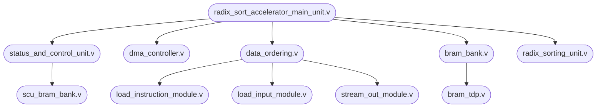

# Near Memory Radix Sort Documentation
> This document contains information related to near memory radix sort project, especially module dependencies and module operations.

 

## Table of Content

[toc]

## Context
*Contributors*: Dalta Imam Maulana, Jihwan Cho
*Tools*: Vivado 2020.1
*Document Version*: July 29th, 2021
&nbsp;

## System Architecture
> The architecture overview of near memory radix sort accelerator is described in the section below

#### Processing System and RAM
Processing system is used as an interface between user and accelerator as shown in the figure below. Meanwhile, RAM is used to store the unsorted data and also act as storage to store sorted data from the accelerator. In this design, processing system is a dedicated ARM processor that is capable of running Linux and PYNQ Framework. User can use PYNQ Framework to control the operation of accelerator by writing an application using Python language.

<b>Figure 1 - System Level 0 Diagram</b>

#### Radix Sort Accelerator IP Core

<b>Figure 2 - System Level 1 Diagram</b>

Radix Sort Accelerator IP Core consists of 5 modules as shown in the figure above. Those modules are:
* **AXI Lite Master**: acts as an interface between DMA controller block and AXI DMA block. This module is required since AXI DMA can only be controlled via AXI protocol.
* **AXI Lite Slave**: receives instructions from processing system block and send the instruction to status and control unit to be decoded.
* **AXI Stream Master**: responsible for sending sorted result data from BRAM bank to onboard DRAM via AXI DMA module.
* **AXI Stream Slave**: responsible for receiving unsorted data from onboard DRAM via AXI DMA module.
* **Radix Sort Accelerator Main Unit**: consists of **DMA controller** to control DMA operation, **data ordering and BRAM controller** to control dataflow from and to BRAM and sorting unit, **BRAM bank** to store sorted and unsorted data, **sorting unit** to sort data based on radix sorting algorithm, and **status and control unit** to control operation of each module inside the FPGA fabric.

#### AXI Lite Master Interface
AXI Lite Master uses AXI4 Lite protocol. This module is based on Xilinx's template code generated via Vivado software. This unit is responsible for controlling AXI Direct Memory Access (DMA). This unit is controlled by DMA controller module using the signals below:
	**1. Source / Destination Address** [O_DMA_REG_ADDRESS]
	**2. Number of Byte to Transfer** [O_DMA_NO_OF_TRANSACTION]
	**3. Transfer Mode** [O_DMA_TRANSFER_MODE]

DMA operation mode can be set by configuring the transfer mode signal. DMA operation mode that is supported by this module are:
	1. **Starting AXI DMA**
	2. **Request transfer from DRAM** (via MM2S channel)
	3. **Request transfer to DRAM** (via S2MM channel) 

In the Vivado, the AXI DMA is configured to use **Direct Register Mode** (ref: **https://www.xilinx.com/support/documentation/ip_documentation/axi_dma/v7_1/pg021_axi_dma.pdf**). Therefore, every transaction is initiated via AXI4 Lite write request.

<b>Figure 3 - Starting AXI DMA Waveform </b>

**Two AXI4 Lite requests are needed to start AXI DMA**. The first request is to write the AXI DMA register at address 0x0 with data 0x1. This request will start the MM2S channel of DMA. The second request is to write the AXI DMA register at address 0x30 with data 0x1. This
request will start the S2MM channel of DMA. The request order in this request is not important.

<b>Figure 4 - Read from DRAM Request Waveform </b>

**Two AXI4 Lite requests are needed to request read data from DRAM via AXI DMA**. The first request is to write the AXI DMA register at address 0x18 with the source address. The
second request is to write the AXI DMA register at address 0x28 with a number of bytes to
transfer. This second request will also start the transaction. The request order is important
since sending request no of byte to transfer will start the transaction.

<b>Figure 5 - Write to DRAM Request Waveform </b>

**Two AXI4 Lite requests are needed to request write data to DRAM via AXI DMA**. The first request is to write the AXI DMA register at address 0x48 with the destination address. The second request is to write the AXI DMA register at address 0x58 with a number of bytes to transfer. This request will also start the transaction. The request order is important since the second request will start the transaction.

**Note**: The transaction can be terminated early with AXI_TLAST from the master stream. The no of byte transferred will be updated to no of byte received by DMA. DMA will not return an error and accept this as a valid transfer. Not sending AXI_TLAST or sending data more than byte to transfer will result in DMA error (0x5002).

**It must be noted that after finishing a write transaction, DMA can be stalled for several clocks** (ranging from 32-128 clock, it is unknown what caused it, therefore consecutive writes should be spaced and not back-to-back). This event is not happening on read requests. The properties that indicate this event happening is when the AXI Lite master successfully sends a request for the first write to DRAM, and almost immediately requests another transaction after the first one finished (in the span of < 128 clocks usually). The DMA status register will show the right destination address and number of bytes to transfer (usually the register value is fine) but not initiating the request.

#### AXI Lite Slave Interface
AXI Lite Slave uses AXI4 Lite protocol. This module is based on Xilinx's template code generated via Vivado software. This unit is responsible to receive/send a control signal from the Processing System (PS). In current design, there are 82 internal registers (7 essential registers, 63 debug registers, and 12 unused registers). This unit sends and receives signals below:
	**1. Start Signal** [I_GLOBAL_START]
	**2. Input Address** [I_ADDR_INPUT]
	**3. Instruction Address** [I_ADDR_INSTRUCTION]
	**4. Output Address** [I_ADDR_OUTPUT]
	**5. Debug Signals**

The register address of each signals is shown in the table below:

| Slv Reg | Address | Category | Read/Write | Details |
| ---- | ---- | ---- | ---- | ---- |
| 0 | 0x000 | Start Signal | Both | This register is used to start the accelerator|
| 1 | 0x004 | Input Address | Both | This register is used to provide unsorted input data address in DRAM |
| 2 | 0x008 | Instruction Address | Both | This register is used to provide instruction address in DRAM |
| 3 | 0x00C | Output Address | Both | This register is used to provide output data address in DRAM |

**Request order example**
Initial setup:

	1. Write instruction address to register 0x008
	2. Write 0x1 value to register 0x000 (start load instruction process)
	3. Write 0x0 value to register 0x000
	Start sorting process:
	1. Write input address to register 0x004
	2. Write output address to register 0x008
	3. Write 0x1 value to register 0x000 (start sorting process)
	4. Write 0x0 value to register 0x000	
	5. Read and wait until Register 0x24 16-bit LSB (program counter) equal to 2
	6. Repeat step 1 for another data

#### AXI Stream Master Interface
AXI Stream Master uses AXI4 Stream protocol. This module is based on Xilinx's template code generated via Vivado software. This unit is responsible for sending a stream data from BRAM bank to DRAM via AXI DMA. This module has an internal buffer (queue) with size of 1024x128 bit.

<b>Figure 6 - AXI Stream Master Interface</b>

After AXI Lite master request write transaction to DRAM to AXI DMA unit, AXI Stream master will assert TVALID along with the corresponding TDATA. If the slave (AXI DMA) reply with TREADY signal, the data will be transferred to DRAM and master can send the next data. But, master shouldn't de-assert TVALID signal or change TDATA before slave assert TREADY signal.

When both TVALID and TREADY signal are asserted, data will be sent to DRAM. Therefore, master can proceed to next data transfer. Master can also de-assert TVALID signal after a transaction to stall the transaction if necessary (in case of empty queue). But, it should be noted that if TVALID signal value is low for a long time, DMA error may happen (error 0x5002).

**Note:** master should always asserts TLAST signal to indicate the last data packet or DMA will return an error and halt the process.

<b>Figure 7 - Writing Data to DRAM via AXI DMA Waveform (Start)</b>

<b>Figure 8 - Writing Data to DRAM via AXI DMA Waveform (End)</b>

Figure above shows the process of writing data to DRAM via AXI DMA. When transaction is complete, AXI stream master will asserts **DATA_SEND_DONE** signal to the status and control unit to indicate that the data transfer has been done successfully. It should be noted that it is forbidden to do another DMA request in the middle of transaction. If there is another DMA request in the middle of transaction, DMA will return an error and halt the process. In case of FIFO full, the unit that wants to send data to DRAM should be paused and wait until FIFO is not full (FIFO full signal de-asserted).

#### AXI Stream Slave Interface

AXI Stream Slave uses AXI4 Stream protocol. This module is based on Xilinx's template code generated via Vivado software. This unit is responsible for receiving stream data from DRAM via AXI DMA. This unit has an internal buffer (queue) with the size of 1024x128 bit.

<b>Figure 8 - AXI Stream Slave Interface</b>

After requesting read data from DRAM to DMA, the DMA will assert TVALID along with the
corresponding TDATA. If the slave replies with TREADY signal, then the data transmission is
success and Stream Master can send next data. Data should only be sampled when both TVALID and TREADY signal is HIGH. Therefore, stream_fifo_write_enable logic is TVALID
&& TREADY. This also mean that the data are being queued into the Stream Queue.

Stream Dequeue should be asserted HIGH when data is needed and kept HIGH as long as
STREAM_VALID is LOW or more data is needed. If the Stream Queue is FULL, then the
TREADY signal will go LOW and this will pause the transaction on the AXI side until some unit
read data from the queue. If the Stream Queue is EMPTY, then STREAM_VALID will kept
LOW indicating that there is no data in the stream.

**Note:** TLAST is an optional signal for stream slaves and not used in current implementation. AXI Stream Slave is one-way communication, the state 0 is indicating IDLE and 1 is indicating RECEIVING data.

<b>Figure 9 - Receiving Data form DRAM via AXI DMA Waveform</b>

#### DMA Controller
DMA controller is a module that forwards request from Status and Control Unit (SCU) to AXI Lite Master unit. This module receives start pulse. source/destination address, number of byte to transfer, number of received transaction (only used when writing data to DRAM), DMA operation (0: Starting DMA, 1: Read DMA, 2: Write DMA).

<b>Figure 10 - DMA Controller Waveform Example</b>

#### BRAM Bank
BRAM bank receives several memory address pointers and receive/send data to/from corresponding BRAM. BRAM bank consists of three main section which are Instruction BRAM, Input Data BRAM, and Output Data BRAM. In current design, Instruction BRAM has 1024 address space with each address can store 64-bit data. Meanwhile, Input and Output Data BRAM has 32768 address space with each address space can store 128-bit data.

#### Data Ordering

<b>Figure 11 - Data Ordering Block Diagram</b>

Data ordering module consists of:
**1. Load Instruction Module**
This module forward data from AXI Stream Slave to instruction BRAM. This module also converts 128-bit data stream into 64-bit stream of data. In current design, this module is used to load exactly 1024 instruction from DRAM. The number of instruction can be changed by changing the **MAXINSTCOUNT** in the **load_instruction_module.v** file.
**2. Load Input Module**
This module forward data from AXI Stream Slave to input data BRAM without changing the stream bitwidth.
**3. Stream Out Module**
This module is used to generate 128-bit stream data from output BRAM. This data will be sent to DRAM via AXI Stream Master module.

#### Status and Control Unit (SCU)

#### Radix Sort Accelerator Main Unit

> **Please update this part  ^^**

## Dependency Tree

#### Top Level Dependency Tree

#### Radix Sort Main Unit Dependency Tree

