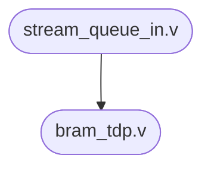

# Near Memory Radix Sort Documentation
> This document contains information related to near memory radix sort project, especially module dependencies and module operations.

 

## Table of Content

[toc]

## Context
*Contributors*: Dalta Imam Maulana, Jihwan Cho
*Tools*: Vivado 2020.1
*Document Version*: July 29th, 2021
&nbsp;

## System Architecture
> The architecture overview of near memory radix sort accelerator is described in the section below

### Processing System and RAM
Processing system is used as an interface between user and accelerator as shown in the figure below. Meanwhile, RAM is used to store the unsorted data and also act as storage to store sorted data from the accelerator. In this design, processing system is a dedicated ARM processor that is capable of running Linux and PYNQ Framework. User can use PYNQ Framework to control the operation of accelerator by writing an application using Python language.


<p align = "center"><b>Figure 1 - System Level 0 Diagram</b></p>

### Radix Sort Accelerator IP Core


<p align = "center"><b>Figure 2 - System Level 1 Diagram</b></p>

Radix Sort Accelerator IP Core consists of 5 modules as shown in the figure above. Those modules are:
* **AXI Lite Master**: acts as an interface between DMA controller block and AXI DMA block. This module is required since AXI DMA can only be controlled via AXI protocol.
* **AXI Lite Slave**: receives instructions from processing system block and send the instruction to status and control unit to be decoded.
* **AXI Stream Master**: responsible for sending sorted result data from BRAM bank to onboard DRAM via AXI DMA module.
* **AXI Stream Slave**: responsible for receiving unsorted data from onboard DRAM via AXI DMA module.
* **Radix Sort Accelerator Main Unit**: consists of **DMA controller** to control DMA operation, **data ordering and BRAM controller** to control dataflow from and to BRAM and sorting unit, **BRAM bank** to store sorted and unsorted data, **sorting unit** to sort data based on radix sorting algorithm, and **status and control unit** to control operation of each module inside the FPGA fabric.

### AXI Lite Master Interface
AXI Lite Master uses AXI4 Lite protocol. This module is based on Xilinx's template code generated via Vivado software. This unit is responsible for controlling AXI Direct Memory Access (DMA). This unit is controlled by DMA controller module using the signals below:
	**1. Source / Destination Address** [O_DMA_REG_ADDRESS]
	**2. Number of Byte to Transfer** [O_DMA_NO_OF_TRANSACTION]
	**3. Transfer Mode** [O_DMA_TRANSFER_MODE]

DMA operation mode can be set by configuring the transfer mode signal. DMA operation mode that is supported by this module are:
	1. **Starting AXI DMA**
	2. **Request transfer from DRAM** (via MM2S channel)
	3. **Request transfer to DRAM** (via S2MM channel) 

In the Vivado, the AXI DMA is configured to use **Direct Register Mode** (ref: **https://www.xilinx.com/support/documentation/ip_documentation/axi_dma/v7_1/pg021_axi_dma.pdf**). Therefore, every transaction is initiated via AXI4 Lite write request.


<p align = "center"><b>Figure 3 - Starting AXI DMA Waveform </b></p>

**Two AXI4 Lite requests are needed to start AXI DMA**. The first request is to write the AXI DMA register at address 0x0 with data 0x1. This request will start the MM2S channel of DMA. The second request is to write the AXI DMA register at address 0x30 with data 0x1. This
request will start the S2MM channel of DMA. The request order in this request is not important.


<p align = "center"><b>Figure 4 - Read from DRAM Request Waveform </b></p>

**Two AXI4 Lite requests are needed to request read data from DRAM via AXI DMA**. The first request is to write the AXI DMA register at address 0x18 with the source address. The
second request is to write the AXI DMA register at address 0x28 with a number of bytes to
transfer. This second request will also start the transaction. The request order is important
since sending request no of byte to transfer will start the transaction.


<p align = "center"><b>Figure 5 - Write to DRAM Request Waveform </b></p>

**Two AXI4 Lite requests are needed to request write data to DRAM via AXI DMA**. The first request is to write the AXI DMA register at address 0x48 with the destination address. The second request is to write the AXI DMA register at address 0x58 with a number of bytes to transfer. This request will also start the transaction. The request order is important since the second request will start the transaction.

**Note**: The transaction can be terminated early with AXI_TLAST from the master stream. The no of byte transferred will be updated to no of byte received by DMA. DMA will not return an error and accept this as a valid transfer. Not sending AXI_TLAST or sending data more than byte to transfer will result in DMA error (0x5002).

**It must be noted that after finishing a write transaction, DMA can be stalled for several clocks** (ranging from 32-128 clock, it is unknown what caused it, therefore consecutive writes should be spaced and not back-to-back). This event is not happening on read requests. The properties that indicate this event happening is when the AXI Lite master successfully sends a request for the first write to DRAM, and almost immediately requests another transaction after the first one finished (in the span of < 128 clocks usually). The DMA status register will show the right destination address and number of bytes to transfer (usually the register value is fine) but not initiating the request.

### AXI Lite Slave Interface
AXI Lite Slave uses AXI4 Lite protocol. This module is based on Xilinx's template code generated via Vivado software. This unit is responsible to receive/send a control signal from the Processing System (PS). In current design, there are 82 internal registers (7 essential registers, 63 debug registers, and 12 unused registers). This unit sends and receives signals below:
	**1. Start Signal** [I_GLOBAL_START]
	**2. Input Address** [I_ADDR_INPUT]
	**3. Instruction Address** [I_ADDR_INSTRUCTION]
	**4. Output Address** [I_ADDR_OUTPUT]
	**5. Debug Signals**

The register address of each signals is shown in the table below:

| Slv Reg | Address | Category | Read/Write | Details |
| ---- | ---- | ---- | ---- | ---- |
| 0 | 0x000 | Start Signal | Both | This register is used to start the accelerator|
| 1 | 0x004 | Input Address | Both | This register is used to provide unsorted input data address in DRAM |
| 2 | 0x008 | Instruction Address | Both | This register is used to provide instruction address in DRAM |
| 3 | 0x00C | Output Address | Both | This register is used to provide output data address in DRAM |

**Request order example**
Initial setup:

	1. Write instruction address to register 0x008
	2. Write 0x1 value to register 0x000 (start load instruction process)
	3. Write 0x0 value to register 0x000
	Start sorting process:
	1. Write input address to register 0x004
	2. Write output address to register 0x008
	3. Write 0x1 value to register 0x000 (start sorting process)
	4. Write 0x0 value to register 0x000	
	5. Read and wait until Register 0x24 16-bit LSB (program counter) equal to 2
	6. Repeat step 1 for another data

### AXI Stream Master Interface
AXI Stream Master uses AXI4 Stream protocol. This module is based on Xilinx's template code generated via Vivado software. This unit is responsible for sending a stream data from BRAM bank to DRAM via AXI DMA. This module has an internal buffer (queue) with size of 1024x128 bit.


<p align = "center"><b>Figure 6 - AXI Stream Master Interface</b></p>

After AXI Lite master request write transaction to DRAM to AXI DMA unit, AXI Stream master will assert TVALID along with the corresponding TDATA. If the slave (AXI DMA) reply with TREADY signal, the data will be transferred to DRAM and master can send the next data. But, master shouldn't de-assert TVALID signal or change TDATA before slave assert TREADY signal.

When both TVALID and TREADY signal are asserted, data will be sent to DRAM. Therefore, master can proceed to next data transfer. Master can also de-assert TVALID signal after a transaction to stall the transaction if necessary (in case of empty queue). But, it should be noted that if TVALID signal value is low for a long time, DMA error may happen (error 0x5002).

**Note:** master should always asserts TLAST signal to indicate the last data packet or DMA will return an error and halt the process.


<p align = "center"><b>Figure 7 - Writing Data to DRAM via AXI DMA Waveform (Start)</b></p>


<p align = "center"><b>Figure 8 - Writing Data to DRAM via AXI DMA Waveform (End)</b></p>
Figure above shows the process of writing data to DRAM via AXI DMA. When transaction is complete, AXI stream master will asserts **DATA_SEND_DONE** signal to the status and control unit to indicate that the data transfer has been done successfully. It should be noted that it is forbidden to do another DMA request in the middle of transaction. If there is another DMA request in the middle of transaction, DMA will return an error and halt the process. In case of FIFO full, the unit that wants to send data to DRAM should be paused and wait until FIFO is not full (FIFO full signal de-asserted).

### AXI Stream Slave Interface

AXI Stream Slave uses AXI4 Stream protocol. This module is based on Xilinx's template code generated via Vivado software. This unit is responsible for receiving stream data from DRAM via AXI DMA. This unit has an internal buffer (queue) with the size of 1024x128 bit.


<p align = "center"><b>Figure 9 - AXI Stream Slave Interface</b></p>

After requesting read data from DRAM to DMA, the DMA will assert TVALID along with the
corresponding TDATA. If the slave replies with TREADY signal, then the data transmission is
success and Stream Master can send next data. Data should only be sampled when both TVALID and TREADY signal is HIGH. Therefore, stream_fifo_write_enable logic is TVALID
&& TREADY. This also mean that the data are being queued into the Stream Queue.

Stream Dequeue should be asserted HIGH when data is needed and kept HIGH as long as
STREAM_VALID is LOW or more data is needed. If the Stream Queue is FULL, then the
TREADY signal will go LOW and this will pause the transaction on the AXI side until some unit
read data from the queue. If the Stream Queue is EMPTY, then STREAM_VALID will kept
LOW indicating that there is no data in the stream.

**Note:** TLAST is an optional signal for stream slaves and not used in current implementation. AXI Stream Slave is one-way communication, the state 0 is indicating IDLE and 1 is indicating RECEIVING data.


<p align = "center"><b>Figure 10 - Receiving Data form DRAM via AXI DMA Waveform</b></p>

### DMA Controller
DMA controller is a module that forwards request from Status and Control Unit (SCU) to AXI Lite Master unit. This module receives start pulse. source/destination address, number of byte to transfer, number of received transaction (only used when writing data to DRAM), DMA operation (0: Starting DMA, 1: Read DMA, 2: Write DMA).


<p align = "center"><b>Figure 11 - DMA Controller Waveform Example</b></p>

### BRAM Bank
BRAM bank receives several memory address pointers and receive/send data to/from corresponding BRAM. BRAM bank consists of three main section which are Instruction BRAM, Input Data BRAM, and Output Data BRAM. In current design, Instruction BRAM has 1024 address space with each address can store 64-bit data. Meanwhile, Input and Output Data BRAM has 32768 address space with each address space can store 128-bit data.

### Data Ordering


<p align = "center"><b>Figure 12 - Data Ordering Block Diagram</b></p>

Data ordering module consists of:
**1. Load Instruction Module**
This module forward data from AXI Stream Slave to instruction BRAM. This module also converts 128-bit data stream into 64-bit stream of data. In current design, this module is used to load exactly 1024 instruction from DRAM. The number of instruction can be changed by changing the **MAXINSTCOUNT** in the **load_instruction_module.v** file.
**2. Load Input Module**
This module forward data from AXI Stream Slave to input data BRAM without changing the stream bitwidth.
**3. Stream Out Module**
This module is used to generate 128-bit stream data from output BRAM. This data will be sent to DRAM via AXI Stream Master module.

### Status and Control Unit (SCU)


### Radix Sort Accelerator Main Unit

> **Please update this part  ^^**


## Design Breakdown

> This section contains detailed explanation about each RTL modules from parameters, ports, and module behavior

### Module radix_sort_accelerator_v1_0 
This module is implemented in radix_sort_accelerator_v1_0.v file
#### Module Dependencies


#### Module Parameters
| Name | Type | Default Value | Description |
| --- | --- | --- | --- |
| C_S00_AXI_FROM_PS_DATA_WIDTH | integer | 32 | Parameters of AXI Slave Bus Interface S00_AXI_FROM_PS |
| C_S00_AXI_FROM_PS_ADDR_WIDTH | integer | 9 |  |
| C_M00_AXI_TO_DMA_START_DATA_VALUE | unknown | 32'hAA000000 | Parameters of AXI Master Bus Interface M00_AXI_TO_DMA |
| C_M00_AXI_TO_DMA_TARGET_SLAVE_BASE_ADDR | unknown | 32'h00000000 |  |
| C_M00_AXI_TO_DMA_ADDR_WIDTH | integer | 32 |  |
| C_M00_AXI_TO_DMA_DATA_WIDTH | integer | 32 |  |
| C_M00_AXI_TO_DMA_TRANSACTIONS_NUM | integer | 2 |  |
| C_S00_AXIS_TDATA_WIDTH | integer | 128 | Parameters of AXI Slave Bus Interface S00_AXIS |
| C_M00_AXIS_TDATA_WIDTH | integer | 128 | Parameters of AXI Master Bus Interface M00_AXIS |

#### Module Ports

| Name | Direction | Type | Description |
| --- | --- | --- | --- |
| pl_to_ps_irq | out | logic | Interrupt Pin |
| s00_axi_from_ps_aclk | in | logic | Ports of AXI Slave Bus Interface S00_AXI_FROM_PS |
| s00_axi_from_ps_aresetn | in | logic |  |
| s00_axi_from_ps_awaddr | in | [C_S00_AXI_FROM_PS_ADDR_WIDTH-1:0] logic |  |
| s00_axi_from_ps_awprot | in | [2:0] logic |  |
| s00_axi_from_ps_awvalid | in | logic |  |
| s00_axi_from_ps_awready | out | logic |  |
| s00_axi_from_ps_wdata | in | [C_S00_AXI_FROM_PS_DATA_WIDTH-1:0] logic |  |
| s00_axi_from_ps_wstrb | in | [(C_S00_AXI_FROM_PS_DATA_WIDTH/8)-1:0] logic |  |
| s00_axi_from_ps_wvalid | in | logic |  |
| s00_axi_from_ps_wready | out | logic |  |
| s00_axi_from_ps_bresp | out | [1:0] logic |  |
| s00_axi_from_ps_bvalid | out | logic |  |
| s00_axi_from_ps_bready | in | logic |  |
| s00_axi_from_ps_araddr | in | [C_S00_AXI_FROM_PS_ADDR_WIDTH-1:0] logic |  |
| s00_axi_from_ps_arprot | in | [2:0] logic |  |
| s00_axi_from_ps_arvalid | in | logic |  |
| s00_axi_from_ps_arready | out | logic |  |
| s00_axi_from_ps_rdata | out | [C_S00_AXI_FROM_PS_DATA_WIDTH-1:0] logic |  |
| s00_axi_from_ps_rresp | out | [1:0] logic |  |
| s00_axi_from_ps_rvalid | out | logic |  |
| s00_axi_from_ps_rready | in | logic |  |
| m00_axi_to_dma_aclk | in | logic | Ports of AXI Master Bus Interface M00_AXI_TO_DMA |
| m00_axi_to_dma_aresetn | in | logic |  |
| m00_axi_to_dma_awaddr | out | [C_M00_AXI_TO_DMA_ADDR_WIDTH-1:0] logic |  |
| m00_axi_to_dma_awprot | out | [2:0] logic |  |
| m00_axi_to_dma_awvalid | out | logic |  |
| m00_axi_to_dma_awready | in | logic |  |
| m00_axi_to_dma_wdata | out | [C_M00_AXI_TO_DMA_DATA_WIDTH-1:0] logic |  |
| m00_axi_to_dma_wstrb | out | [C_M00_AXI_TO_DMA_DATA_WIDTH/8-1:0] logic |  |
| m00_axi_to_dma_wvalid | out | logic |  |
| m00_axi_to_dma_wready | in | logic |  |
| m00_axi_to_dma_bresp | in | [1:0] logic |  |
| m00_axi_to_dma_bvalid | in | logic |  |
| m00_axi_to_dma_bready | out | logic |  |
| m00_axi_to_dma_araddr | out | [C_M00_AXI_TO_DMA_ADDR_WIDTH-1:0] logic |  |
| m00_axi_to_dma_arprot | out | [2:0] logic |  |
| m00_axi_to_dma_arvalid | out | logic |  |
| m00_axi_to_dma_arready | in | logic |  |
| m00_axi_to_dma_rdata | in | [C_M00_AXI_TO_DMA_DATA_WIDTH-1:0] logic |  |
| m00_axi_to_dma_rresp | in | [1:0] logic |  |
| m00_axi_to_dma_rvalid | in | logic |  |
| m00_axi_to_dma_rready | out | logic |  |
| s00_axis_aclk | in | logic | Ports of AXI Slave Bus Interface S00_AXIS |
| s00_axis_aresetn | in | logic |  |
| s00_axis_tready | out | logic |  |
| s00_axis_tdata | in | [C_S00_AXIS_TDATA_WIDTH-1:0] logic |  |
| s00_axis_tstrb | in | [(C_S00_AXIS_TDATA_WIDTH/8)-1:0] logic |  |
| s00_axis_tlast | in | logic |  |
| s00_axis_tvalid | in | logic |  |
| m00_axis_aclk | in | logic | Ports of AXI Master Bus Interface M00_AXIS |
| m00_axis_aresetn | in | logic |  |
| m00_axis_tvalid | out | logic |  |
| m00_axis_tdata | out | [C_M00_AXIS_TDATA_WIDTH-1:0] logic |  |
| m00_axis_tstrb | out | [(C_M00_AXIS_TDATA_WIDTH/8)-1:0] logic |  |
| m00_axis_tlast | out | logic |  |
| m00_axis_tready | in | logic |  |


### Module radix_sort_accelerator_v1_0_S00_AXI_FROM_PS 

This module is implemented in radix_sort_accelerator_v1_0_S00_AXI_FROM_PS.v file

#### Module Dependencies


#### Module Parameters

| Name | Type | Default Value | Description |
| --- | --- | --- | --- |
| C_S_AXI_DATA_WIDTH | integer | 32 | Width of S_AXI data bus |
| C_S_AXI_ADDR_WIDTH | integer | 9 | Width of S_AXI address bus |
| ADDR_LSB | integer | (C_S_AXI_DATA_WIDTH/32) + 1 | Example-specific design signals local parameter for addressing 32 bit / 64 bit C_S_AXI_DATA_WIDTH ADDR_LSB is used for addressing 32/64 bit registers/memories ADDR_LSB = 2 for 32 bits (n downto 2) ADDR_LSB = 3 for 64 bits (n downto 3) |
| OPT_MEM_ADDR_BITS | integer | 6 |  |

#### Module Ports

| Name | Direction | Type | Description |
| --- | --- | --- | --- |
| O_GLOBAL_START | out | logic | Global start signal received from user application. This signal is used to start the accelerator |
| O_ADDR_INPUT | out | [C_S_AXI_DATA_WIDTH-1:0] logic | This port contains information about the address of input data in DRAM |
| O_ADDR_INSTRUCTION | out | [C_S_AXI_DATA_WIDTH-1:0] logic | This port contains information about the address of instructions in DRAM |
| O_ADDR_OUTPUT | out | [C_S_AXI_DATA_WIDTH-1:0] logic | This port contains information about the address of output data in DRAM |
| O_FORCE_LOAD_INSTRUCTION | out | logic | **Not used in current design** |
| I_PROGRAM_COUNTER | in | [C_S_AXI_DATA_WIDTH-1:0] logic | This port contains information about accelerator current program counter (debugging purpose) |
| O_BRAM_DEBUG_ADDR | out | [C_S_AXI_DATA_WIDTH-1:0] logic | **Not used in current design** |
| O_BRAM_MODE_DEBUG | out | [2:0] logic | **Not used in current design** |
| I_BRAM_DEBUG_INSTRUCTION | in | [63:0] logic | **Not used in current design** |
| I_BRAM_DEBUG_WEIGHT | in | [71:0] logic | **Not used in current design** |
| I_BRAM_DEBUG_FMAP | in | [127:0] logic | **Not used in current design** |
| I_BRAM_DEBUG_BIAS | in | [31:0] logic | **Not used in current design** |
| I_BRAM_DEBUG_OUT_0 | in | [447:0] logic | **Not used in current design** |
| I_BRAM_DEBUG_OUT_1 | in | [447:0] logic | **Not used in current design** |
| I_BRAM_DEBUG_DLQ | in | [447:0] logic | **Not used in current design** |
| I_BRAM_DEBUG_MP | in | [447:0] logic | **Not used in current design** |
| I_REG_DEBUG_SCALE_POS | in | [31:0] logic | **Not used in current design** |
| I_REG_DEBUG_SCALE_NEG | in | [31:0] logic | **Not used in current design** |
| I_FSM_STREAM_MASTER | in | [7:0] logic | This port contains information about AXI stream master current state (debugging purpose) |
| I_FSM_STREAM_SLAVE | in | [7:0] logic | This port contains information about AXI stream slave current state (debugging purpose) |
| I_FSM_DMA_CONTROLLER | in | [7:0] logic | This port contains information about DMA controller current state (debugging purpose) |
| I_IRQ_SIGNAL | in | logic | **Not used in current design** |
| I_STATE_COUNTER | in | [31:0] logic |  |
| I_FIFO_STATUS_SLAVE | in | [1:0] logic | This port contains information about AXI stream slave FIFO status (debugging purpose) |
| I_FIFO_STATUS_MASTER | in | [1:0] logic | This port contains information about AXI stream master FIFO status (debugging purpose) |
| I_PC_CHANGED | in | logic |  |
| I_SCU_STATE_MACHINE | in | [3:0] logic |  |
| I_INTERNAL_COUNTER | in | [3:0] logic |  |
| I_INSTRUCTION_OUT | in | [31:0] logic |  |
| I_SORT_STATE | in | [2:0] logic |  |
| I_FIRST_STATE | in | [2:0] logic |  |
| I_EVEN_STATE | in | [3:0] logic |  |
| I_ODD_STATE | in | [3:0] logic |  |
| I_DATA_STATE | in | [3:0] logic |  |
| I_SORT_START | in | logic |  |
| I_SORT_START_DELAY | in | logic |  |
| I_POINTER0 | in | [9:0] logic |  |
| I_POINTER1 | in | [9:0] logic |  |
| I_ADDR1 | in | [9:0] logic |  |
| I_ADDR2 | in | [9:0] logic |  |
| I_LI_COUNT | in | [31:0] logic | This port contains information about the number of clock cycles needed to send unsorted data from DRAM to BRAM |
| I_RS_COUNT | in | [31:0] logic | This port contains information about the number of clock cycles needed to do radix sorting process |
| I_SO_COUNT | in | [31:0] logic | This port contains information about the number of clock cycles needed to send the sorted data from BRAM to DRAM |
| I_ALL_COUNT | in | [31:0] logic | This port contains information about the total number of clock cycles needed to run the sorting process (from load input to stream out) |
| S_AXI_ACLK | in | logic | Global Clock Signal |
| S_AXI_ARESETN | in | logic | Global Reset Signal. This Signal is Active LOW |
| S_AXI_AWADDR | in | [C_S_AXI_ADDR_WIDTH-1:0] logic | Write address (issued by master, acceped by Slave) |
| S_AXI_AWPROT | in | [2:0] logic |  |
| S_AXI_AWVALID | in | logic |  |
| S_AXI_AWREADY | out | logic |  |
| S_AXI_WDATA | in | [C_S_AXI_DATA_WIDTH-1:0] logic | Write data (issued by master, acceped by Slave) |
| S_AXI_WSTRB | in | [(C_S_AXI_DATA_WIDTH/8)-1:0] logic |  |
| S_AXI_WVALID | in | logic |  |
| S_AXI_WREADY | out | logic |  |
| S_AXI_BRESP | out | [1:0] logic |  |
| S_AXI_BVALID | out | logic |  |
| S_AXI_BREADY | in | logic |  |
| S_AXI_ARADDR | in | [C_S_AXI_ADDR_WIDTH-1:0] logic | Read address (issued by master, acceped by Slave) |
| S_AXI_ARPROT | in | [2:0] logic |  |
| S_AXI_ARVALID | in | logic |  |
| S_AXI_ARREADY | out | logic |  |
| S_AXI_RDATA | out | [C_S_AXI_DATA_WIDTH-1:0] logic | Read data (issued by slave) |
| S_AXI_RRESP | out | [1:0] logic |  |
| S_AXI_RVALID | out | logic |  |
| S_AXI_RREADY | in | logic |  |


### Module radix_sort_accelerator_v1_0_M00_AXI_TO_DMA 

This module is implemented in radix_sort_accelerator_v1_0_M00_AXI_TO_DMA.v file

#### Module Dependencies


#### Module Parameters

| Name | Type | Default Value | Description |
| --- | --- | --- | --- |
| C_M_TARGET_SLAVE_BASE_ADDR | unknown | 32'h40000000 | The master requires a target slave base address. |
| C_M_AXI_ADDR_WIDTH | integer | 32 | Width of M_AXI address bus. |
| C_M_AXI_DATA_WIDTH | integer | 32 | Width of M_AXI data bus. |
| C_M_TRANSACTIONS_NUM | integer | 2 | Transaction number is the number of write |
| TRANS_NUM_BITS | integer | clogb2(C_M_TRANSACTIONS_NUM-1) |  |
| IDLE | [1:0] logic | 2'b00 | This state issues the status of comparison |
| INIT_WRITE | [1:0] logic | 2'b01 | This state issues the status of comparison |
| TRANSACTION_DONE | [1:0] logic | 2'b10 | This state issues the status of comparison |
| INIT_READ | [1:0] logic | 2'b11 | This state issues the status of comparison |

#### Module Ports

| Name | Direction | Type | Description |
| --- | --- | --- | --- |
| I_REG_ADDRESS | in | [C_M_AXI_DATA_WIDTH-1:0] logic |  |
| I_REG_DATA | in | [C_M_AXI_DATA_WIDTH-1:0] logic |  |
| I_TRANSFER_MODE | in | [1:0] logic |  |
| I_INIT_AXI_TXN | in | logic | Initiate AXI transactions |
| O_AXI_TXN_DONE | out | logic |  |
| O_FSM_DMA_CONTROLLER | out | [7:0] logic |  |
| I_BRAM_DEBUG_ADDR | in | [31:0] logic |  |
| O_DATA_LOGGER | out | [63:0] logic |  |
| M_AXI_ACLK | in | logic | AXI clock signal |
| M_AXI_ARESETN | in | logic | AXI active low reset signal |
| M_AXI_AWADDR | out | [C_M_AXI_ADDR_WIDTH-1:0] logic | Master Interface Write Address Channel ports. Write address (issued by master) |
| M_AXI_AWPROT | out | [2:0] logic | Write channel Protection type. |
| M_AXI_AWVALID | out | logic | Write address valid. |
| M_AXI_AWREADY | in | logic | Write address ready. |
| M_AXI_WDATA | out | [C_M_AXI_DATA_WIDTH-1:0] logic | Master Interface Write Data Channel ports. Write data (issued by master) |
| M_AXI_WSTRB | out | [C_M_AXI_DATA_WIDTH/8-1:0] logic | Write strobes. |
| M_AXI_WVALID | out | logic | Write valid. This signal indicates that valid write data and strobes are available. |
| M_AXI_WREADY | in | logic | Write ready. This signal indicates that the slave can accept the write data. |
| M_AXI_BRESP | in | [1:0] logic | Master Interface Write Response Channel ports. |
| M_AXI_BVALID | in | logic | Write response valid. |
| M_AXI_BREADY | out | logic | Response ready. This signal indicates that the master can accept a write response. |
| M_AXI_ARADDR | out | [C_M_AXI_ADDR_WIDTH-1:0] logic | Master Interface Read Address Channel ports. Read address (issued by master) |
| M_AXI_ARPROT | out | [2:0] logic | Protection type. |
| M_AXI_ARVALID | out | logic | Read address valid. |
| M_AXI_ARREADY | in | logic | Read address ready. |
| M_AXI_RDATA | in | [C_M_AXI_DATA_WIDTH-1:0] logic | Master Interface Read Data Channel ports. Read data (issued by slave) |
| M_AXI_RRESP | in | [1:0] logic | Read response. This signal indicates the status of the read transfer. |
| M_AXI_RVALID | in | logic | Read valid. This signal indicates that the channel is signaling the required read data. |
| M_AXI_RREADY | out | logic | Read ready. This signal indicates that the master can accept the read data and response information. |


### Module radix_sort_accelerator_v1_0_S00_AXIS

This module is implemented in radix_sort_accelerator_v1_0_S00_AXIS.v file

#### Module Dependencies


#### Module Parameters

| Name | Type | Default Value | Description |
| --- | --- | --- | --- |
| C_S_AXIS_TDATA_WIDTH | integer | 128 | AXI4Stream sink: Data Width |
| IDLE | [1:0] logic | 2'h0 | Define the states of AXI Slave stream state machine (No operation) |
| STREAM_FIFO | [1:0] logic | 2'h1 | Define the states of AXI Slave stream state machine (Sending data) |
| FIFO_FULL | [1:0] logic | 2'h2 | Define the states of AXI Slave stream state machine (Slave FIFO full) |

#### Module Ports

| Name | Direction | Type | Description |
| --- | --- | --- | --- |
| I_STREAM_DEQUEUE | in | logic | This signal is used to dequeue data from AXIS slave FIFO |
| O_STREAM_VALID | out | logic | This signal is used in handshaking process when other module ask for new data to this module |
| O_STREAM_FIFO | out | [127:0] logic | This port contains queue output data |
| O_STREAM_EMPTY | out | logic | This port contains information about AXIS slave FIFO empty flag |
| O_FSM_STREAM_SLAVE | out | [7:0] logic | This port contains information about AXIS slave FIFO current state |
| I_STREAM_DEBUG_ADDR | in | [31:0] logic | **Not used in current design** |
| O_STREAM_FIFO_INPUT_DEBUG | out | [127:0] logic | **Not used in current design** |
| O_FIFO_STATUS | out | [1:0] logic | **Not used in current design** |
| S_AXIS_ACLK | in | logic | AXI4Stream sink: Clock |
| S_AXIS_ARESETN | in | logic | AXI4Stream sink: Reset |
| S_AXIS_TREADY | out | logic | Ready to accept data in |
| S_AXIS_TDATA | in | [C_S_AXIS_TDATA_WIDTH-1:0] logic | Data in |
| S_AXIS_TSTRB | in | [(C_S_AXIS_TDATA_WIDTH/8)-1:0] logic | Byte qualifier |
| S_AXIS_TLAST | in | logic | Indicates boundary of last packet |
| S_AXIS_TVALID | in | logic | Data is in valid |


### Module stream_queue_in

This module is implemented in stream_queue_in.v file

#### Module Dependencies



#### Module Parameters

| Name | Type | Default Value | Description |
| --- | --- | --- | --- |
| DWIDTH | unknown | 128 | Stream in data width |
| SIZE | unknown | 1024 | Stream in FIFO depth |
| ADDR_BIT | unknown | 10 | Stream in FIFO address bit |

#### Module Ports
| Name | Direction | Type | Description |
| --- | --- | --- | --- |
| I_CLK | in | logic | Clock signal |
| I_RSTN | in | logic | Reset signal (**active low**) |
| I_QUEUE | in | logic | This port is used by FIFO to queue (store) input data |
| I_DEQUEUE | in | logic | This port is used by FIFO to dequeue (send) data |
| I_DATA | in | [DWIDTH-1:0] logic | Input data port |
| O_EMPTY | out | logic | This port contains information about FIFO empty flag |
| O_ALMOST_FULL | out | logic | This port contains information about FIFO almost full flag |
| O_FULL | out | logic | This port contains information about FIFO full flag |
| O_DATA_VALID | out | logic | This port is used during handshaking process when other modules ask AXI slave stream for new data |
| O_DATA | out | [DWIDTH-1:0] logic | This port contains queue output data |
| I_DEBUG_ADDR | in | [ADDR_BIT-1:0] logic | **Not used in current design** |
| O_DEBUG_DATA | out | [DWIDTH-1:0] logic | **Not used in current design** |


### Module radix_sort_accelerator_v1_0_M00_AXIS

This module is implemented in radix_sort_accelerator_v1_0_M00_AXIS.v file

#### Module Dependencies


#### Module Parameters

| Name | Type | Default Value | Description |
| --- | --- | --- | --- |
| FIFO_ADDR_BIT | integer | 10 | User parameter FIFO Address bit |
| C_M_AXIS_TDATA_WIDTH | integer | 128 | AXI Parameter Width of S_AXIS address bus. The slave accepts the read and write addresses of width C_M_AXIS_TDATA_WIDTH. |
| IDLE | [1:0] logic | 2'b00 | State for sending stream data through output port |
| WAIT_FIFO | [1:0] logic | 2'b01 | State for sending stream data through output port |
| SEND_STREAM | [1:0] logic | 2'b10 | State for sending stream data through output port |

#### Module Ports

| Name | Direction | Type | Description |
| --- | --- | --- | --- |
| I_FIFO_IN_QUEUE | in | logic | Signal for storing data to FIFO |
| I_FIFO_IN_DATA | in | [C_M_AXIS_TDATA_WIDTH-1:0] logic |  |
| O_FIFO_ALMOST_FULL | out | logic |  |
| O_FIFO_OUT_FULL | out | logic |  |
| I_NO_OF_TRANSACTION | in | [31:0] logic | FSM Signal |
| O_FSM_STREAM_MASTER | out | [7:0] logic |  |
| O_DATA_SEND_DONE | out | logic |  |
| O_FIFO_STATUS | out | [1:0] logic | Debug signal |
| M_AXIS_ACLK | in | logic | AXI master stream clock signal |
| M_AXIS_ARESETN | in | logic | AXI master stream reset signal (active low) |
| M_AXIS_TVALID | out | logic | Master Stream Ports. TVALID indicates that the master is driving a valid transfer, A transfer takes place when both TVALID and TREADY are asserted. |
| M_AXIS_TDATA | out | [C_M_AXIS_TDATA_WIDTH-1:0] logic | TDATA is the primary payload that is used to provide the data that is passing across the interface from the master. |
| M_AXIS_TSTRB | out | [(C_M_AXIS_TDATA_WIDTH/8)-1:0] logic | TSTRB is the byte qualifier that indicates whether the content of the associated byte of TDATA is processed as a data byte or a position byte. |
| M_AXIS_TLAST | out | logic | TLAST indicates the boundary of a packet. |
| M_AXIS_TREADY | in | logic | TREADY indicates that the slave can accept a transfer in the current cycle. |


### Module stream_queue_out

This module is implemented in stream_queue_out.v file

#### Module Dependencies


#### Module Parameters

| Name | Type | Default Value | Description |
| --- | --- | --- | --- |
| DWIDTH | unknown | 128 | Stream out data width |
| SIZE | unknown | 1024 | Stream out FIFO depth |
| ADDR_BIT | unknown | 10 | Stream out FIFO address bit |

#### Module Ports
| Name | Direction | Type | Description |
| --- | --- | --- | --- |
| I_CLK | in | logic | Clock signal |
| I_RSTN | in | logic | Reset signal (**active low**) |
| I_QUEUE | in | logic | This port is used by FIFO to queue (store) input data |
| I_DEQUEUE | in | logic | This port is used by FIFO to dequeue (send) data |
| I_DATA | in | [DWIDTH-1:0] logic | Input data port |
| O_EMPTY | out | logic | Output data port |
| O_ALMOST_FULL | out | logic | This port contains information about FIFO empty flag |
| O_FULL | out | logic | This port contains information about FIFO full flag |
| O_DATA_VALID | out | logic | This port is used during handshaking process when other modules ask AXI slave stream for new data |
| O_DATA | out | [DWIDTH-1:0] logic | This port contains queue output data |
| O_DATA_INDEX | out | [ADDR_BIT-1:0] logic | **Not used in current design** |
| I_DEBUG_ADDR | in | [ADDR_BIT-1:0] logic | **Not used in current design** |
| O_DEBUG_DATA | out | [DWIDTH-1:0] logic | **Not used in current design** |


### Module radix_sort_accelerator_main_unit

This module is implemented in radix_sort_accelerator_main_unit.v file

#### Module Dependencies


#### Module Parameters
| Name | Type | Default Value | Description |
| --- | --- | --- | --- |
| DWIDTH        | integer | 128           | Default data width                |
| SELWIDTH      | integer | 10            | BRAM selector logic bitwidth      |
| INSTWIDTH     | integer | 64            | Default Instruction width         |
| DATABRAMDEPTH | integer | 32768         | Data BRAM depth                   |
| DATAADDRWIDTH | integer | 17            | Data BRAM address bitwidth        |
| INSTADDRWIDTH | integer | 10            | Instruction BRAM address bitwidth |
| NOT_USED | integer | 0 | Unused FSM state |

#### Module Ports
| Name | Direction | Type | Description |
| --- | --- | --- | --- |
| I_ACLK | in | logic | Clock signal |
| I_ARESETN | in | logic | Reset signal (active low) |
| I_GLOBAL_START | in | logic | Signal From PS |
| I_ADDR_INPUT | in | [31:0] logic |  |
| I_ADDR_INSTRUCTION | in | [31:0] logic |  |
| I_ADDR_OUTPUT | in | [31:0] logic |  |
| I_FORCE_LOAD_INSTRUCTION | in | logic |  |
| O_PROGRAM_COUNTER | out | [31:0] logic | Monitor Signal |
| O_STATE_LOGGER_DATA | out | [31:0] logic |  |
| I_BRAM_DEBUG_ADDR | in | [31:0] logic | Debug BRAM |
| I_BRAM_MODE_DEBUG | in | [2:0] logic |  |
| O_BRAM_DEBUG_INSTRUCTION | out | [63:0] logic |  |
| O_BRAM_DEBUG_WEIGHT | out | [71:0] logic |  |
| O_BRAM_DEBUG_FMAP | out | [127:0] logic |  |
| O_BRAM_DEBUG_BIAS | out | [31:0] logic |  |
| O_BRAM_DEBUG_OUT_0 | out | [447:0] logic |  |
| O_BRAM_DEBUG_OUT_1 | out | [447:0] logic |  |
| O_BRAM_DEBUG_DLQ | out | [447:0] logic |  |
| O_BRAM_DEBUG_MP | out | [447:0] logic |  |
| O_REG_DEBUG_SCALE_POS | out | [31:0] logic |  |
| O_REG_DEBUG_SCALE_NEG | out | [31:0] logic |  |
| I_STREAM_FIFO | in | [DWIDTH-1:0] logic |  |
| O_STREAM_DEQUEUE | out | logic |  |
| I_STREAM_VALID | in | logic |  |
| I_STREAM_EMPTY | in | logic |  |
| O_STREAM_FIFO | out | [DWIDTH-1:0] logic |  |
| O_STREAM_QUEUE | out | logic |  |
| I_STREAM_FULL | in | logic |  |
| I_STREAM_ALMOST_FULL | in | logic |  |
| I_DATA_SEND_DONE | in | logic |  |
| O_DMA_REG_ADDRESS | out | [31:0] logic |  |
| O_DMA_REG_DATA | out | [31:0] logic |  |
| O_DMA_INIT_AXI_TXN | out | logic |  |
| I_DMA_AXI_TXN_DONE | in | logic |  |
| O_DMA_NO_OF_TRANSACTION | out | [31:0] logic |  |
| O_DMA_TRANSFER_MODE | out | [1:0] logic |  |
| O_PL_TO_PS_IRQ | out | logic |  |
| O_PC_CHANGED | out | logic |  |
| O_SCU_STATE_MACHINE | out | [3:0] logic |  |
| O_INTERNAL_COUNTER | out | [3:0] logic |  |
| O_INSTRUCTION_OUT | out | [31:0] logic |  |
| O_SORT_STATE | out | [2:0] logic |  |
| O_FIRST_STATE | out | [2:0] logic |  |
| O_EVEN_STATE | out | [3:0] logic |  |
| O_ODD_STATE | out | [3:0] logic |  |
| O_DATA_STATE | out | [3:0] logic |  |
| O_LI_COUNT | out | [31:0] logic |  |
| O_RS_COUNT | out | [31:0] logic |  |
| O_SO_COUNT | out | [31:0] logic |  |
| O_ALL_COUNT | out | [31:0] logic |  |
| O_POINTER0 | out | [DATAADDRWIDTH-1:0] logic |  |
| O_POINTER1 | out | [DATAADDRWIDTH-1:0] logic |  |
| O_ADDR1 | out | [DATAADDRWIDTH-1:0] logic |  |
| O_ADDR2 | out | [DATAADDRWIDTH-1:0] logic |  |
| O_SORT_START | out | logic |  |
| O_SORT_START_DELAY | out | logic |  |


### Module status_and_control_unit

This module is implemented in status_and_control_unit.v file

#### Module Dependencies


#### Module Parameters

| Name | Type | Default Value | Description |
| --- | --- | --- | --- |
| DWIDTH               | integer     | 128           | Default data width                |
| SELWIDTH             | integer     | 10            | BRAM selector logic bitwidth      |
| INSTWIDTH            | integer     | 64            | Default Instruction width         |
| DATABRAMDEPTH        | integer     | 32768         | Data BRAM depth                   |
| DATAADDRWIDTH        | integer     | 17            | Data BRAM address bitwidth        |
| INSTADDRWIDTH        | integer     | 10            | Instruction BRAM address bitwidth |
| SCU_IDLE | [3:0] logic | 4'd0 | Declare localparam |
| SCU_WAIT_SETUP | [3:0] logic | 4'd1 | Declare localparam |
| SCU_LOAD_INSTRUCTION | [3:0] logic | 4'd2 | Declare localparam |
| SCU_RUNNING | [3:0] logic | 4'd3 | Declare localparam |

#### Module Ports

| Name | Direction | Type | Description |
| --- | --- | --- | --- |
| I_ACLK | in | logic |  |
| I_ARESETN | in | logic |  |
| I_GLOBAL_START | in | logic | Signal From PS |
| I_FORCE_LOAD_INSTRUCTION | in | logic | Also work as debug signal for BRAM Bank Mode |
| I_BRAM_DEBUG_ADDR | in | [31:0] logic |  |
| O_PL_TO_PS_IRQ | out | logic |  |
| O_STATE_LOGGER_DATA | out | [31:0] logic |  |
| I_INSTRUCTION_DATA | in | [63:0] logic | Monitor Signal |
| O_PROGRAM_COUNTER | out | [INSTADDRWIDTH-1:0] logic |  |
| O_LOAD_INSTRUCTION_START | out | logic | Load Instruction Channel |
| I_LOAD_INSTRUCTION_DONE | in | logic |  |
| O_LI_START | out | logic | Load Input Channel |
| O_LI_NO_OF_ROW | out | [31:0] logic |  |
| O_LI_START_POINTER | out | [DATAADDRWIDTH-1:0] logic |  |
| O_LI_SEL | out | [SELWIDTH-1:0] logic |  |
| I_LI_DONE | in | logic |  |
| O_SO_START | out | logic | Stream Out |
| O_SO_START_POINTER | out | [DATAADDRWIDTH-1:0] logic |  |
| O_SO_END_POINTER | out | [DATAADDRWIDTH-1:0] logic |  |
| I_SO_DONE | in | logic |  |
| O_DMA_START | out | logic | DMA Controller <===> SCU // |
| O_DMA_ADDR | out | [31:0] logic |  |
| O_DMA_BYTE_TO_TRANSFER | out | [31:0] logic |  |
| O_DMA_NO_OF_TRANSACTION | out | [31:0] logic |  |
| O_DMA_MODE | out | [2:0] logic |  |
| I_DMA_DONE | in | logic |  |
| I_DATA_SEND_DONE | in | logic |  |
| O_SORTING_START | out | logic | Radix Sorting <===> SCU // |
| I_SORTING_DONE | in | logic |  |
| O_LI_COUNT | out | [31:0] logic |  |
| O_RS_COUNT | out | [31:0] logic |  |
| O_SO_COUNT | out | [31:0] logic |  |
| O_ALL_COUNT | out | [31:0] logic |  |
| O_PC_CHANGED | out | logic |  |
| O_SCU_STATE_MACHINE | out | [3:0] logic |  |
| O_INTERNAL_COUNTER | out | [3:0] logic |  |
| O_INSTRUCTION_OUT | out | [31:0] logic |  |


### Module scu_bram_bank

This module is implemented in scu_bram_bank.v file

#### Module Dependencies


#### Module Parameters

| Name | Type | Default Value | Description |
| --- | --- | --- | --- |
| DWIDTH          | integer     | 128           | Default data width                |
| SELWIDTH        | integer     | 10            | BRAM selector logic bitwidth      |
| INSTWIDTH       | integer     | 64            | Default Instruction width         |
| DATABRAMDEPTH   | integer     | 32768         | Data BRAM depth                   |
| DATAADDRWIDTH   | integer     | 17            | Data BRAM address bitwidth        |
| INSTADDRWIDTH   | integer     | 10            | Instruction BRAM address bitwidth |
| STATE_IDLE | [1:0] logic | 2'b00 | State machine |
| STATE_SET | [1:0] logic | 2'b01 | State machine |
| STATE_INCREMENT | [1:0] logic | 2'b10 | State machine |
| STATE_DONE | [1:0] logic | 2'b11 | State machine |


#### Module Ports

| Name | Direction | Type | Description |
| --- | --- | --- | --- |
| I_ACLK | in | logic | Clock and Reset |
| I_ARESETN | in | logic |  |
| I_SEL_REG | in | [7:0] logic | Input from SCU |
| I_SEL_MULTIPLE | in | [7:0] logic |  |
| I_EN_MULTIPLE | in | [3:0] logic |  |
| I_SEL_COL | in | [3:0] logic |  |
| I_VALUE | in | [31:0] logic |  |
| I_MODE | in | [1:0] logic | 2'b00 = nothing, 2'b01 = set reg, 2'b10 = increment reg, 2'b11 = do loop |
| I_INSTRUCTION_OPCODE | in | [7:0] logic |  |
| I_START | in | logic |  |
| O_DONE | out | logic |  |
| O_DMA_ADDRESS | out | [31:0] logic | Signal from status and control unit which contains information about DRAM read/write address (**not used in current design** since the transaction always start at input, instruction, or output base address) |
| O_DMA_BYTE_TO_TRANSFER | out | [31:0] logic | Signal from status and control unit which contains information about number of byte the DMA should read/write from/to DRAM |
| O_DMA_NO_OF_TRANSACTION | out | [31:0] logic | Signal from status and control unit which contains information about the number of transaction the DMA should perform to read data from DRAM to BRAM. This number can be calculated by dividing total number of bytes by 16 since one DMA transaction transfer 8 bytes of data at a time |
| O_LI_START_POINTER | out | [DATAADDRWIDTH-1:0] logic | Signal that is used to set the initial BRAM address for load input process |
| O_SO_START_POINTER | out | [DATAADDRWIDTH-1:0] logic | This port contains information about first address of the output data in the BRAM |
| O_SO_END_POINTER | out | [DATAADDRWIDTH-1:0] logic | This port contains information about last address of the output data in the BRAM |
| O_LOOP_I | out | [15:0] logic | Number of I loop in instruction (**not used in current design**) |
| O_LOOP_I_MAX | out | [15:0] logic | Maximum number of I loop in instruction (**not used in current design**) |
| O_LOOP_J | out | [15:0] logic | Number of J loop in instruction (**not used in current design**) |
| O_LOOP_J_MAX | out | [15:0] logic | Maximum number of J loop in instruction (**not used in current design**) |
| O_LOOP_K | out | [15:0] logic | Number of K loop in instruction (**not used in current design**) |
| O_LOOP_K_MAX | out | [15:0] logic | Maximum number of K loop in instruction (**not used in current design**) |
| O_LOOP_L | out | [15:0] logic | Number of L loop in instruction (**not used in current design**) |
| O_LOOP_L_MAX | out | [15:0] logic | Maximum number of L loop in instruction (**not used in current design**) |


### Module dma_controller

This module is implemented in dma_controller.v file

#### Module Dependencies


#### Module Parameters

| Name | Type | Default Value | Description |
| --- | --- | --- | --- |
| IDLE | [1:0] logic | 2'd0 | Common DMA state machine |
| RUNNING | [1:0] logic | 2'd1 | Common DMA state machine                                |
| DONE | [1:0] logic | 2'd2 | Common DMA state machine                                |
| TF_MODE_IDLE | [2:0] logic | 3'd0 | Local DMA state machine (**idle mode**)                 |
| TF_MODE_ON | [2:0] logic | 3'd1 | Local DMA state machine (**DMA on mode**) |
| TF_MODE_READ_RAM | [2:0] logic | 3'd2 | Local DMA state machine (**DMA read mode**) |
| TF_MODE_WRITE_RAM | [2:0] logic | 3'd3 | Local DMA state machine (**DMA write mode**) |
| TF_MODE_LOAD_INSTRUCTION | [2:0] logic | 3'd4 | Local DMA state machine (**DMA load instruction mode**) |
| TF_MODE_DONE | [2:0] logic | 3'd5 | Local DMA state machine (**transaction done**) |


#### Module Ports
| Name | Direction | Type | Description |
| --- | --- | --- | --- |
| I_ACLK | in | logic | Clock signal |
| I_ARESETN | in | logic | Reset signal (**active low**) |
| I_START | in | logic | Signal from status and control unit to start DMA controller |
| I_ADDR | in | [31:0] logic | Signal from status and control unit which contains information about DRAM read/write address (**not used in current design** since the transaction always start at input, instruction, or output base address) |
| I_BYTE_TO_TRANSFER | in | [31:0] logic | Signal from status and control unit which contains information about number of byte the DMA should read/write from/to DRAM |
| I_NO_OF_RECV_TRANSACTION | in | [31:0] logic | Signal from status and control unit which contains information about the number of transaction the DMA should perform to read data from DRAM to BRAM. This number can be calculated by dividing total number of bytes by 16 since one DMA transaction transfer 8 bytes of data at a time |
| I_MODE | in | [2:0] logic | Signal from status and control unit which determines DMA operation mode (**DMA On**, **Read RAM**, **Write RAM**, or **Load Instruction**) |
| I_ADDR_INPUT | in | [31:0] logic | Unsorted input base address in DRAM |
| I_ADDR_INSTRUCTION | in | [31:0] logic | Instruction base address in DRAM |
| I_ADDR_OUTPUT | in | [31:0] logic | Sorted output base address in DRAM |
| O_DONE | out | logic | Signal for marking the end of DMA transaction |
| O_DMA_REG_ADDRESS | out | [31:0] logic | Signal from DMA controller to AXI lite master which contains information about DRAM read/write address |
| O_DMA_REG_DATA | out | [31:0] logic | Signal from DMA controller to AXI lite master which contains information about number of bytes the DMA needs to send/receive |
| O_DMA_INIT_AXI_TXN | out | logic | Signal from DMA controller to AXI lite master which marks the start of DMA transaction |
| I_DMA_AXI_TXN_DONE | in | logic | Signal from AXI lite master to DMA controller which marks the end of DMA transaction |
| O_DMA_NO_OF_TRANSACTION | out | [31:0] logic | Signal from DMA controller to AXI lite master which contains information about number of transaction DMA needs to perform |
| O_DMA_TRANSFER_MODE | out | [1:0] logic | Signal from DMA controller to AXI lite master which contains information about DMA operation mode (**DMA On**, **Read RAM**, **Write RAM**, or **Load Instruction**) |
| I_BRAM_DEBUG_ADDR | in | [31:0] logic | Debug port (**not used in current design**) |

#### RTL Breakdown
```verilog
////////////////////////////////////////
//     General State Machine Logic    //
////////////////////////////////////////
// Declare local parameters
localparam [1:0] IDLE    = 2'd0,
                    RUNNING = 2'd1,
                    DONE    = 2'd2;

// Declare local parameters
localparam [2:0] TF_MODE_IDLE = 3'd0,
                    TF_MODE_ON = 3'd1,
                    TF_MODE_READ_RAM = 3'd2,
                    TF_MODE_WRITE_RAM = 3'd3,
                    TF_MODE_LOAD_INSTRUCTION = 3'd4,
                    TF_MODE_DONE = 3'd5;

// Declare registers
reg [1:0] r_internal_state;
reg [2:0] r_dma_controller_state;

// Assign done and stream send signal value
assign O_DONE = (r_internal_state == DONE);

// State machine logic
always @(posedge I_ACLK) 
begin
    if (!I_ARESETN)
    begin
        r_internal_state <= IDLE;
    end    
    else
    begin
        case (r_internal_state)
            IDLE:
            begin
                if (w_start_pulse)
                begin
                    r_internal_state <= RUNNING;
                end
                else
                begin
                    r_internal_state <= IDLE;
                end
            end
            RUNNING:
            begin
                if (r_dma_controller_state == TF_MODE_DONE)
                begin
                    r_internal_state <= DONE;
                end
                else
                begin
                    r_internal_state <= RUNNING;
                end
            end
            DONE:
            begin
                r_internal_state <= IDLE;
            end
            default:
            begin
                r_internal_state <= IDLE;
            end
        endcase
    end
end
```

The code snippet above shows the common state machine logic inside the DMA controller module. By default, DMA controller module will stay at IDLE state until the module receive **start_pulse** signal generated by using I_START signal from status and control unit. When **start_pulse** signal is asserted, load input  module state will change into RUNNING state and will retain the state until **r_dma_controller_state** reach **TF_MODE_DONE** state. If **r_dma_controller_state** reach **TF_MODE_DONE** state is asserted, the common DMA state will change into DONE state and come back to IDLE state one clock cycle later. 

```verilog
////////////////////////////////
//     DMA Operation Logic    //
////////////////////////////////
// Declare registers
reg [3:0] r_no_of_req_issued;
wire [3:0] w_no_of_req_max;

// State logic
always @(posedge I_ACLK) 
begin
    if (!I_ARESETN || r_internal_state != RUNNING)
    begin
        r_dma_controller_state <= TF_MODE_IDLE;
    end    
    else
    begin
        case (r_dma_controller_state)
            TF_MODE_IDLE:
            begin
                if (I_MODE == 0)
                begin
                    r_dma_controller_state <= TF_MODE_ON;
                end
                else if (I_MODE == 1)
                begin
                    r_dma_controller_state <= TF_MODE_READ_RAM;
                end
                else if (I_MODE == 2)
                begin
                    r_dma_controller_state <= TF_MODE_WRITE_RAM;
                end
                else if (I_MODE == 3)
                begin
                    r_dma_controller_state <= TF_MODE_LOAD_INSTRUCTION;
                end
                else
                begin
                    r_dma_controller_state <= TF_MODE_IDLE;
                end
            end
            TF_MODE_ON, TF_MODE_READ_RAM, TF_MODE_WRITE_RAM, TF_MODE_LOAD_INSTRUCTION:
            begin
                if ((r_no_of_req_issued == (w_no_of_req_max-1)) && I_DMA_AXI_TXN_DONE)
                begin
                    r_dma_controller_state <= TF_MODE_DONE;
                end
                else
                begin
                    r_dma_controller_state <= r_dma_controller_state;
                end
            end
            default:
            begin
                r_dma_controller_state <= r_dma_controller_state;
            end
        endcase
    end
end

// Request issued logic
always @(posedge I_ACLK)
begin
    if (!I_ARESETN || (r_internal_state != RUNNING))
    begin
        r_no_of_req_issued <= 0;
    end
    else
    begin
        if (I_DMA_AXI_TXN_DONE)
        begin
            r_no_of_req_issued <= r_no_of_req_issued + 1;
        end
        else
        begin
            r_no_of_req_issued <= r_no_of_req_issued;
        end
    end
end

// Request max logic
assign w_no_of_req_max = 1;
```

The code snippet above shows the logic behind DMA controller local state machine. Initially, local DMA state machine will be in IDLE state since the common DMA controller state machine is not in RUNNING mode. When DMA controller common state machine changes to RUNNING mode the local DMA state machine will change its state according to I_MODE signal from status and control unit. The possible state machine for local DMA state machine is listed below:
* If **I_MODE equal to 0**, local DMA state machine will change into **TF_MODE_ON** state. This state will **turn on the DMA** block.
* If **I_MODE equal to 1**, local DMA state machine will change into **TF_MODE_READ_RAM** state. This state will set **DMA into read operation** mode.
* If **I_MODE equal to 2**, local DMA state machine will change into **TF_MODE_WRITE_RAM** state. This state will set **DMA into write operation** mode.
* If **I_MODE equal to 3**, local DMA state machine will change into **TF_MODE_LOAD_INSTRUCTION** state. This state will set **DMA into read operation** mode.

When the local DMA controller state is at one of **TF_MODE_ON**, **TF_MODE_READ_RAM**, **TF_MODE_WRITE_RAM**, or **TF_MODE_LOAD_INSTRUCTION** state and DMA controller receive **I_DMA_AXI_TXN_DONE** signal from AXI lite master, the local DMA controller state will change into **TF_MODE_DONE** since the DMA transaction is complete. In the logic above, **r_no_of_req_issued** signal can be omitted since in current design, the maximum number of DMA transaction is limited to 1 transaction at a time.


```verilog
//******************************//
//     Initial Counter Logic    //
//******************************//
// Declare register
reg [1:0] r_init_counter;

// Counter logic
always @(posedge I_ACLK) 
begin
    if (!I_ARESETN || (r_internal_state != RUNNING) || I_DMA_AXI_TXN_DONE)
    begin
        r_init_counter <= 0;
    end    
    else
    begin
        if (r_dma_controller_state != TF_MODE_IDLE)
        begin
            if (r_init_counter == 3)
            begin
                r_init_counter <= r_init_counter;
            end
            else
            begin
                r_init_counter <= r_init_counter + 1;
            end
        end
        else
        begin
            r_init_counter <= 0;
        end
    end
end

//****************************************//
//     Register Address and Data Logic    //
//****************************************//
// Declare registers
reg [31:0] r_reg_address;
reg [31:0] r_reg_data;

// Address and data logic
always @(posedge I_ACLK) 
begin
    if (!I_ARESETN || (r_internal_state != RUNNING))
    begin
        r_reg_address <= 0;
        r_reg_data <= 0;
    end    
    else
    begin
        case (r_dma_controller_state)
            TF_MODE_ON:
            begin
                r_reg_address <= 1;
                r_reg_data <= 1;
            end
            TF_MODE_READ_RAM:
            begin
                r_reg_address <= I_ADDR_INPUT;
                r_reg_data <= I_BYTE_TO_TRANSFER;
            end
            TF_MODE_WRITE_RAM:
            begin
                r_reg_address <= I_ADDR_OUTPUT;
                r_reg_data <= I_BYTE_TO_TRANSFER;
            end
            TF_MODE_LOAD_INSTRUCTION:
            begin
                r_reg_address <= I_ADDR_INSTRUCTION;
                r_reg_data <= 8*1024; // 1024 x 64-bit instruction
            end
            default:
            begin
                r_reg_address <= 0;
                r_reg_data <= 0;
            end
        endcase
    end
end

// Assign value to output port
assign O_DMA_REG_ADDRESS = r_reg_address;
assign O_DMA_REG_DATA = r_reg_data;
assign O_DMA_NO_OF_TRANSACTION = I_NO_OF_RECV_TRANSACTION; // Only Used when receiving data in iteration means bytes/16
assign O_DMA_INIT_AXI_TXN = (r_internal_state == RUNNING) && (r_init_counter == 2);

// DMA transfer mode
always @(*) 
begin
    case (I_MODE)
        1, 3: // Read RAM or read instruction
        begin
            O_DMA_TRANSFER_MODE = 1; // Read RAM
        end
        2: // Write RAM
        begin
            O_DMA_TRANSFER_MODE = 2; // Write RAM
        end
        default:
        begin
            O_DMA_TRANSFER_MODE = 0; // IDLE
        end
    endcase    
end
```

The code snippet above shows how DMA controller set the DMA address, DMA data (control register), and DMA operation mode. In the address and data logic section, DMA controller sets the address and number of byte to transfer according to DMA operation mode. The details of each operation mode can be seen below:

* If **r_dma_controller_state equal to TF_MODE_ON**, both **r_reg_address** and **r_reg_data** value will be set to 1 since in this mode, AXI lite master will only write data to DMA internal register for turning the DMA On without performing any transaction between DRAM and AXI stream slave.

* If **r_dma_controller_state equal to TF_MODE_READ_RAM**, **r_reg_address** value will be set to **I_ADDR_INPUT** and **r_reg_data** value will be set to **I_BYTE_TO_TRANSFER** since we want to read **I_BYTE_TO_TRANSFER** byte of data from DRAM at address  **I_ADDR_INPUT**.

* If **r_dma_controller_state equal to TF_MODE_WRITE_RAM**, **r_reg_address** value will be set to **I_ADDR_OUTPUT** and **r_reg_data** value will be set to **I_BYTE_TO_TRANSFER** since we want to write **I_BYTE_TO_TRANSFER** byte of data to DRAM at address  **I_ADDR_OUTPUT**.

* If **r_dma_controller_state equal to TF_MODE_LOAD_INSTRUCTION**, **r_reg_address** value will be set to **I_ADDR_INSTRUCTION** and **r_reg_data** value will be set to **8*1024** since we want to read **8*1024** byte of data from DRAM at address  **I_ADDR_INSTRUCTION**.

  

### Module data_ordering

This module is implemented in data_ordering.v file

#### Module Dependencies


#### Module Parameters

| Name | Type | Default Value | Description |
| --- | --- | --- | --- |
| DWIDTH        | integer | 128           | Default data width                |
| SELWIDTH      | integer | 10            | BRAM selector logic bitwidth      |
| INSTWIDTH     | integer | 64            | Default Instruction width         |
| DATABRAMDEPTH | integer | 32768         | Data BRAM depth                   |
| DATAADDRWIDTH | integer | 17            | Data BRAM address bitwidth        |
| INSTADDRWIDTH | integer | 10            | Instruction BRAM address bitwidth |

#### Module Ports
| Name | Direction | Type | Description |
| --- | --- | --- | --- |
| I_ACLK | in | logic | Clock signal |
| I_ARESETN | in | logic | Reset signal (**active low**) |
| O_STREAM_DEQUEUE           | out       | logic                     | Signal for dequeuing instruction or data from AXI stream slave queue |
| I_STREAM_VALID             | in        | logic                     | Signal from AXI stream slave queue to mark instruction or data validity |
| I_STREAM_DATA              | in        | [DWIDTH-1:0] logic        | Instruction or data from AXI stream slave queue |
| O_STREAM_QUEUE | out | logic | This signal is used as a queue signal for AXI stream master queue |
| I_STREAM_FULL | in | logic | This port carries AXI stream master queue full flag information |
| I_LOAD_INSTRUCTION_START | in | logic | Signal from status and control unit to start load instruction process |
| O_LOAD_INSTRUCTION_DONE | out | logic | Signal for marking the end of load instruction process |
| O_LOAD_INSTRUCTION_POINTER | out | [INSTADDRWIDTH-1:0] logic | Address pointer for instruction BRAM bank |
| O_LOAD_INSTRUCTION_VALID | out | logic | Signal from AXI stream slave queue to mark data validity |
| O_LOAD_INSTRUCTION_DATA | out | [DWIDTH-1:0] logic | Instruction data from AXI stream slave queue to instruction BRAM bank |
| I_LI_START | in | logic | Signal from status and control unit to start load input process |
| I_LI_NO_OF_ROW             | in        | [31:0] logic              | Signal that is used to set the number of data (BRAM address) to be loaded |
| I_LI_START_POINTER         | in        | [DATAADDRWIDTH-1:0] logic | Signal that is used to set the initial BRAM address for load input process |
| I_LI_SEL | in | [SELWIDTH-1:0] logic | Signal to select which BRAM input the data should be stored (**not used in current design**) |
| O_DONE                     | out       | logic                     | Signal for marking the end of load input process             |
| O_LI_POINTER               | out       | [DATAADDRWIDTH-1:0] logic | Address pointer for input BRAM bank                          |
| O_LI_VALID                 | out       | logic                     | Signal for writing data to input BRAM bank (**write enable**) |
| O_LI_DATA                  | out       | [DWIDTH-1:0] logic        | Data from AXI stream slave queue to input BRAM bank          |
| O_LI_SEL                   | out       | [SELWIDTH-1:0] logic      | Signal to select which BRAM input the data should be stored (**not used in current design**) |
| I_SO_START | in | logic | Signal for starting stream out process |
| I_SO_START_POINTER         | in        | [DATAADDRWIDTH-1:0] logic | This port contains information about first address of the output data in the BRAM |
| I_SO_END_POINTER           | in        | [DATAADDRWIDTH-1:0] logic | This port contains information about last address of the output data in the BRAM |
| O_SO_DONE                  | out       | logic                     | Signal marking the end of stream out process                 |
| O_SO_BRAM_SEL              | out       | [SELWIDTH-1:0] logic      | Signal for selecting BRAM (**not used in current design**)   |
| O_SO_SEND_DATA_POINTER     | out       | [DATAADDRWIDTH-1:0] logic | This port contains information that is used to control which data needs to be sent from BRAM to AXI stream master queue |
| O_SO_POINTER | out | [DATAADDRWIDTH-1:0] logic |  |


### Module load_instruction_module

This module is implemented in load_instruction_module.v file

#### Module Dependencies


#### Module Parameters

| Name | Type | Default Value | Description |
| --- | --- | --- | --- |
| DWIDTH        | integer | 128           | Default data width                                           |
| SELWIDTH      | integer | 10            | BRAM selector logic bitwidth                                 |
| INSTWIDTH     | integer | 64            | Default Instruction width                                    |
| DATABRAMDEPTH | integer | 32768         | Data BRAM depth                                              |
| DATAADDRWIDTH | integer | 17            | Data BRAM address bitwidth                                   |
| INSTADDRWIDTH | integer | 10            | Instruction BRAM address bitwidth |
| MAXINSTCOUNT | integer | 1024 | Number of maximum instruction that can be loaded to instruction BRAM |
| IDLE          | [1:0] logic | 2'd0          | Common load instruction FSM state                            |
| RUNNING       | [1:0] logic | 2'd1          | Common load instruction FSM state                            |
| DONE          | [1:0] logic | 2'd2          | Common load instruction FSM state                            |

#### Module Ports
| Name | Direction | Type | Description |
| --- | --- | --- | --- |
| I_ACLK | in | logic | Clock signal |
| I_ARESETN | in | logic | Reset signal (active low) |
| O_STREAM_DEQUEUE | out | logic | Signal for dequeuing data from AXI stream slave queue |
| I_STREAM_VALID | in | logic | Signal from AXI stream slave queue to mark data validity |
| I_STREAM_DATA | in | [DWIDTH-1:0] logic | Instruction data from AXI stream slave queue |
| I_START | in | logic | Signal from status and control unit to start load instruction process |
| O_DONE | out | logic | Signal for marking the end of load instruction process |
| O_LOAD_INSTRUCTION_POINTER | out | [INSTADDRWIDTH-1:0] logic | Address pointer for instruction BRAM bank |
| O_LOAD_INSTRUCTION_VALID | out | logic | Signal for writing instruction data to instruction BRAM bank (**write enable**) |
| O_LOAD_INSTRUCTION_DATA | out | [DWIDTH-1:0] logic | Instruction data from AXI stream slave queue to instruction BRAM bank |

#### RTL Breakdown
```verilog
////////////////////////////////////////
//        State Machine Logic         //
////////////////////////////////////////
// Declare local parameter
localparam [1:0] IDLE    = 2'd0,
	RUNNING = 2'd1,
	DONE    = 2'd2;

// Declare register
reg [1:0] r_internal_state;
wire w_last;

// Assign last signal logic
assign w_last = (O_LOAD_INSTRUCTION_POINTER == (MAXINSTCOUNT-2)) && I_STREAM_VALID;

// Assign done and stream send signal value
assign O_DONE = (r_internal_state == DONE);

// State machine logic
always @(posedge I_ACLK)
begin
	if (!I_ARESETN)
	begin
		r_internal_state <= IDLE;
	end
	else
	begin
		case (r_internal_state)
			IDLE:
			begin
				if (w_start_pulse)
				begin
					r_internal_state <= RUNNING;
				end
				else
				begin
					r_internal_state <= IDLE;
				end
			end
			RUNNING:
			begin
				if (w_last)
				begin
					r_internal_state <= DONE;
				end
				else
				begin
					r_internal_state <= RUNNING;
				end
			end
			DONE:
			begin
					r_internal_state <= IDLE;
			end
			default:
			begin
					r_internal_state <= IDLE;
			end
		endcase
	end
end
```

The code snippet above shows the common state machine logic inside the load instruction module. By default, load instruction module will stay at IDLE state until the module receive **start_pulse** signal generated by using I_START signal from status and control unit. When **start_pulse** signal is asserted, load input  module state will change into RUNNING state and will retain the state until **w_last** signal is asserted. If w_last signal is asserted, the state will change into DONE state and come back to IDLE state one clock cycle later. **w_last** signal is asserted when the last instruction is transferred from AXI stream slave queue to instruction BRAM. This is happened when **O_LOAD_INSTRUCTION_POINTER** is equal to **MAXINSTCOUNT - 2** (maximum number of instruction) value.

```verilog
///////////////////////////////
//       Pointer Logic       //
///////////////////////////////
// Declare registers
reg [1:0] r_load_instruction_state;
reg [INSTADDRWIDTH-1:0] r_load_instruction_pointer;

// State logic
always @(posedge I_ACLK)
begin
	if (!I_ARESETN)
	begin
		r_load_instruction_state <= 2'd0;
	end
	else
	begin
		if (r_internal_state == RUNNING)
		begin
			case (r_load_instruction_state)
				2'd0: // IDLE
				begin
					r_load_instruction_state <= 2'd1;
				end
				2'd1: // Load instruction
				begin
					if ((r_load_instruction_pointer == (MAXINSTCOUNT-2)) && I_STREAM_VALID)
					begin
						r_load_instruction_state <= 2'd2;
					end
					else
					begin
						r_load_instruction_state <= 2'd1;
					end
				end
				default:
				begin
					r_load_instruction_state <= 2'd0;
				end
			endcase
		end
		else
		begin
			r_load_instruction_state <= 2'd0;
		end
	end
end

// Pointer logic
always @(posedge I_ACLK)
begin
	if (!I_ARESETN || (r_internal_state != RUNNING))
	begin
		r_load_instruction_pointer <= 0;
	end
	else
	begin
		if (O_LOAD_INSTRUCTION_VALID)
		begin
			if (r_load_instruction_pointer == (MAXINSTCOUNT-2))
			begin
				r_load_instruction_pointer <= 0;
			end
			else
			begin
				r_load_instruction_pointer <= r_load_instruction_pointer + 2;
			end
		end
		else
		begin
			r_load_instruction_pointer <= r_load_instruction_pointer;
		end
	end
end
```

The code snippet above shows how the local load instruction state machine and load instruction pointer work. In the load instruction pointer logic section, **r_load_instruction_pointer** register will be reset if **I_RESETN** signal is de-asserted or common load input state machine is not in running state. When common load instruction state machine is in running state, **r_load_instruction_pointer**  value will be incremented if instruction is valid. Otherwise, **r_load_instruction_pointer** value will remain the same. this **r_load_instruction_pointer** value will be used to determine in which address the incoming instruction should be stored on the instruction BRAM.  


### Module load_input_module

This module is implemented in load_input_module.v file

#### Module Dependencies


#### Module Parameters

| Name | Type | Default Value | Description |
| --- | --- | --- | --- |
| DWIDTH        | integer     | 128           | Default data width                |
| SELWIDTH      | integer     | 10            | BRAM selector logic bitwidth      |
| INSTWIDTH     | integer     | 64            | Default Instruction width         |
| DATABRAMDEPTH | integer     | 32768         | Data BRAM depth                   |
| DATAADDRWIDTH | integer     | 17            | Data BRAM address bitwidth        |
| INSTADDRWIDTH | integer     | 10            | Instruction BRAM address bitwidth |
| IDLE | [1:0] logic | 2'd0 | Common load input FSM state |
| RUNNING | [1:0] logic | 2'd1 | Common load input FSM state |
| DONE | [1:0] logic | 2'd2 | Common load input FSM state |

#### Module Ports
| Name | Direction | Type | Description |
| --- | --- | --- | --- |
| I_ACLK | in | logic | Clock signal |
| I_ARESETN | in | logic | Reset signal (**active low**) |
| O_STREAM_DEQUEUE | out | logic | Signal for dequeuing data from AXI stream slave queue |
| I_STREAM_VALID | in | logic | Signal from AXI stream slave queue to mark data validity |
| I_STREAM_DATA | in | [DWIDTH-1:0] logic | Data from AXI stream slave queue |
| I_START | in | logic | Signal from status and control unit to start load input process |
| I_NO_OF_ROW | in | [31:0] logic | Signal that is used to set the number of data (BRAM address) to be loaded |
| I_START_POINTER | in | [DATAADDRWIDTH-1:0] logic | Signal that is used to set the initial BRAM address |
| I_SEL | in | [SELWIDTH-1:0] logic | Signal to select which BRAM input the data should be stored (**not used in current design**) |
| O_DONE | out | logic | Signal for marking the end of load input process |
| O_LI_POINTER | out | [DATAADDRWIDTH-1:0] logic | Address pointer for input BRAM bank |
| O_LI_VALID | out | logic | Signal for writing data to input BRAM bank (**write enable**) |
| O_LI_DATA | out | [DWIDTH-1:0] logic | Data from AXI stream slave queue to input BRAM bank |
| O_LI_SEL | out | [SELWIDTH-1:0] logic | Signal to select which BRAM input the data should be stored (**not used in current design**) |

#### RTL Breakdown
```verilog
///////////////////////////////
//    State Machine Logic    //
///////////////////////////////
// Declare register
reg [31:0] r_data_counter;
reg [DATAADDRWIDTH-1:0] r_load_input_pointer;
reg [1:0] r_internal_state;
wire w_last;

// Assign value for last signal
assign w_last = (r_data_counter == I_NO_OF_ROW-1) && I_STREAM_VALID;

// Assign done and stream send signal value
assign O_DONE = (r_internal_state == DONE);

// State machine logic
always @(posedge I_ACLK)
begin
	if (!I_ARESETN)
	begin
		r_internal_state <= IDLE;
	end
	else
	begin
		case (r_internal_state)
			IDLE:
			begin
				if (w_start_pulse)
				begin
					r_internal_state <= RUNNING;
				end
				else
				begin
					r_internal_state <= IDLE;
				end
			end
			RUNNING:
			begin
				if (w_last)
				begin
					r_internal_state <= DONE;
				end
				else
				begin
					r_internal_state <= RUNNING;
				end
			end
			DONE:
			begin
				r_internal_state <= IDLE;
			end
			default:
			begin
				r_internal_state <= IDLE;
			end
		endcase
	end
end
```

The code snippet above shows the common state machine logic inside the load input module. By default, load input module will stay at IDLE state until the module receive **start_pulse** signal generated by using I_START signal from status and control unit. When **start_pulse** signal is asserted, load input  module state will change into RUNNING state and will retain the state until **w_last** signal is asserted. If w_last signal is asserted, the state will change into DONE state and come back to IDLE state one clock cycle later. **w_last** signal is asserted when the last data is transferred from DRAM to AXI stream slave queue. This is happened when **r_data_counter** is equal to **I_NO_OF_ROW** (number of memory address) value.

```verilog
///////////////////////////////
//       Pointer Logic       //
///////////////////////////////
// Declare registers
reg [1:0] r_load_input_state;

// State machine logic
always @(posedge I_ACLK)
begin
	if (!I_ARESETN)
	begin
		r_load_input_state <= 2'd0;
	end
	else
	begin
		if (r_internal_state == RUNNING)
		begin
			case (r_load_input_state)
				2'd0:
				begin
					r_load_input_state <= 2'd1;
				end
				2'd1:
				begin
					if ((r_data_counter == (I_NO_OF_ROW-1)) && I_STREAM_VALID)
					begin
						r_load_input_state <= 2'd2;
					end
					else
					begin
						r_load_input_state <= 2'd1;
					end
				end
				default:
				begin
					r_load_input_state <= 2'd0;
				end
			endcase
		end
		else
		begin
			r_load_input_state <= 2'd0;
		end
	end
end

// Input pointer logic
always @(posedge I_ACLK)
begin
	if (!I_ARESETN || (r_internal_state != RUNNING))
	begin
		r_load_input_pointer <= 0;
	end
	else
	begin
		if (O_LI_VALID)
		begin
			if (r_load_input_pointer < (DATABRAMDEPTH-1))
			begin
				r_load_input_pointer <= r_load_input_pointer + 1;
			end
			else
			begin
				r_load_input_pointer <= 0;
			end
		end
		else
		begin
			r_load_input_pointer <= r_load_input_pointer;
		end
	end
end

// Data counter logic
always @(posedge I_ACLK)
begin
	if (!I_ARESETN || (r_internal_state != RUNNING))
	begin
		r_data_counter <= 0;
	end
	else
	begin
		if (O_LI_VALID)
		begin
			r_data_counter <= r_data_counter + 1;
		end
		else
		begin
			r_data_counter <= r_data_counter;
		end
	end
end

// Signal to BRAM
assign O_LI_POINTER = I_START_POINTER + r_load_input_pointer;
assign O_LI_VALID = I_STREAM_VALID && (r_load_input_state == 2'd1) && (r_internal_state == RUNNING);
assign O_LI_DATA = I_STREAM_DATA;
```

The code snippet above shows how the local load input state machine and load input pointer work. In the load pointer logic section, **r_load_input_pointer** register will be reset if **I_RESETN** signal is de-asserted or common load input state machine is not in running state. When common load input state machine is in running state, **r_load_input_pointer**  value will be incremented if data is valid. Otherwise, **r_load_input_pointer** value will remain the same. this **r_load_input_pointer** value will be used to determine in which address the incoming data should be stored on the input data BRAM.  

```verilog
// Signal to FIFO input
assign O_STREAM_DEQUEUE = (r_load_input_state == 2'd1);

// BRAM Input selector
always @(*)
begin
	if (r_data_counter < 32768)
	begin
		O_LI_SEL = 10'b0000000000;
	end
	else if ((r_data_counter >= 32768) && (r_data_counter < 65536))
	begin
		O_LI_SEL = 10'b0000000001;
	end
	else
	begin
		O_LI_SEL = 10'b0000000000;
	end
end
```

In the code snippet above, **O_STREAM_DEQUEUE** signal is asserted whenever local load input state is equal to 1 (fetch data state). The **O_STREAM_DEQUEUE** signal is used to dequeue data from AXI stream slave queue and this data will be sent to BRAM bank. In the code above, there are some BRAM input selector logic. But, in the current design, this logic can be omitted since we're only using single BRAM for storing input data.

### Module stream_out_module

This module is implemented in stream_out_module.v file

#### Module Dependencies


#### Module Parameters

| Name | Type | Default Value | Description |
| --- | --- | --- | --- |
| DWIDTH | integer | 128 | Default data width |
| SELWIDTH | integer | 10 | BRAM selector logic bitwidth |
| INSTWIDTH | integer | 64 | Default Instruction width |
| DATABRAMDEPTH | integer | 32768 | Data BRAM depth |
| DATAADDRWIDTH | integer | 17 | Data BRAM address bitwidth |
| INSTADDRWIDTH | integer | 10 | Instruction BRAM address bitwidth |
| IDLE | [1:0] logic | 2'd0 | Common FSM state |
| RUNNING | [1:0] logic | 2'd1 | Common FSM state |
| DONE | [1:0] logic | 2'd2 | Common FSM state |
| DO_SO_STATE_IDLE | [2:0] logic | 3'd0 | Stream out local FSM state |
| DO_SO_STATE_LOAD_BANK | [2:0] logic | 3'd1 | Stream out local FSM state |
| DO_SO_STATE_LOAD_DONE | [2:0] logic | 3'd2 | Stream out local FSM state |

#### Module Ports
| Name | Direction | Type | Description |
| --- | --- | --- | --- |
| I_ACLK | in | logic | Clock signal |
| I_ARESETN | in | logic | Reset signal (**active low**) |
| I_START | in | logic | Signal for starting stream out process |
| I_START_POINTER | in | [DATAADDRWIDTH-1:0] logic | This port contains information about first address of the output data in the BRAM |
| I_END_POINTER | in | [DATAADDRWIDTH-1:0] logic | This port contains information about last address of the output data in the BRAM |
| O_DONE | out | logic | Signal marking the end of stream out process |
| O_BRAM_SEL | out | [SELWIDTH-1:0] logic | Signal for selecting BRAM (**not used in current design**) |
| O_SEND_DATA_POINTER | out | [DATAADDRWIDTH-1:0] logic | This port contains information that is used to control which data needs to be sent from BRAM to AXI stream master queue |
| I_STREAM_FULL | in | logic | This port carries AXI stream master queue full flag information |
| O_STREAM_QUEUE | out | logic | This signal is used as a queue signal for AXI stream master queue |
| O_STREAM_SEND_NOW | out | logic |  |

#### RTL Breakdown
```verilog
///////////////////////////////
//    State Machine Logic    //
///////////////////////////////
// Declare register
reg [1:0] r_internal_state;
wire w_last;

// Assign value for last signal
assign w_last = ((r_internal_state == RUNNING) && (r_do_so_state != DO_SO_STATE_IDLE) && (r_data_counter == {{(32-DATAADDRWIDTH){1'b0}}, I_END_POINTER}));

// Assign done and stream send signal value
assign O_DONE = (r_internal_state == DONE);
assign O_STREAM_SEND_NOW = (w_start_pulse || (r_internal_state == RUNNING));

// State machine logic
always @(posedge I_ACLK)
begin
	if (!I_ARESETN)
	begin
		r_internal_state <= IDLE;
	end
	else
	begin
		case (r_internal_state)
			IDLE:
			begin
				if (w_start_pulse)
				begin
					r_internal_state <= RUNNING;
				end
				else
				begin
					r_internal_state <= IDLE;
				end
			end
			RUNNING:
			begin
				if (w_last)
				begin
					r_internal_state <= DONE;
				end
				else
				begin
					r_internal_state <= RUNNING;
				end
			end
			DONE:
			begin
				r_internal_state <= IDLE;
			end
			default:
			begin
				r_internal_state <= IDLE;
			end
		endcase
	end
end
```

The code snippet above shows the common state machine logic inside the stream out module. By default, stream output module will stay at IDLE state until the module receive **start_pulse** signal generated by using I_START signal from status and control unit. When **start_pulse** signal is asserted, stream output module state will change into RUNNING state and will retain the state until **w_last** signal is asserted. If w_last signal is asserted, the state will change into DONE state and come back to IDLE state one clock cycle later. **w_last** signal is asserted when the last data is transferred from BRAM to AXI stream master queue. This is happened when **r_data_counter** is equal to **I_END_POINTER** value.

```verilog
/////////////////////////////////////
//    Stream Output State Logic    //
/////////////////////////////////////
// Declare local parameter
localparam [2:0]   DO_SO_STATE_IDLE = 3'd0,
	DO_SO_STATE_LOAD_BANK = 3'd1,
	DO_SO_STATE_LOAD_DONE = 3'd2;

// Declare wire and registers
wire w_stream_queue;
reg r_stream_queue_delayed;
wire w_do_so_last;
reg [2:0] r_do_so_state;
reg [DATAADDRWIDTH-1:0] r_send_pointer;
reg [31:0] r_data_counter;

// Assign value to last signal
assign w_do_so_last = ((r_internal_state == RUNNING) && (r_do_so_state != DO_SO_STATE_IDLE) && (r_data_counter == {{(32-DATAADDRWIDTH){1'b0}}, I_END_POINTER}));

// Assign value to stream queue signal
assign w_stream_queue = ((r_internal_state == RUNNING) && (r_do_so_state != DO_SO_STATE_IDLE));
assign O_STREAM_QUEUE = (w_stream_queue && r_stream_queue_delayed) && !I_STREAM_FULL;

// Delay queue signal
always @(posedge I_ACLK)
begin
	r_stream_queue_delayed <= w_stream_queue;
end

// Data pointer logic
always @(posedge I_ACLK)
begin
	if (!I_ARESETN || (r_internal_state != RUNNING))
	begin
		r_send_pointer <= I_START_POINTER;
		r_data_counter <= {{(32-DATAADDRWIDTH){1'b0}}, I_START_POINTER};
	end
	else
	begin
		if (w_start_pulse)
		begin
			r_send_pointer <= I_START_POINTER;
			r_data_counter <= {{(32-DATAADDRWIDTH){1'b0}}, I_START_POINTER};
		end
		else
		begin
			if (!I_STREAM_FULL)
			begin
				if (!w_do_so_last && (r_do_so_state == DO_SO_STATE_LOAD_BANK))
				begin
					if (r_send_pointer < (DATABRAMDEPTH-1))
					begin
						r_send_pointer <= r_send_pointer + 1;
						r_data_counter <= r_data_counter + 1;
					end
					else
					begin
						r_send_pointer <= 0;
						r_data_counter <= r_data_counter + 1;
					end
				end
				else
				begin
					r_send_pointer <= r_send_pointer;
					r_data_counter <= r_data_counter;
				end
			end
			else
			begin
				r_send_pointer <= r_send_pointer;
				r_data_counter <= r_data_counter;
			end
		end
	end
end

// Stream out state logic
always @(posedge I_ACLK)
begin
	if (!I_ARESETN || (r_internal_state != RUNNING))
	begin
		r_do_so_state <= DO_SO_STATE_IDLE;
	end
	else
	begin
		case (r_do_so_state)
			DO_SO_STATE_IDLE:
			begin
				r_do_so_state <= DO_SO_STATE_LOAD_BANK;
			end
			DO_SO_STATE_LOAD_BANK:
			begin
				if (w_do_so_last)
				begin
					r_do_so_state <= DO_SO_STATE_LOAD_DONE;
				end
				else
				begin
					r_do_so_state <= DO_SO_STATE_LOAD_BANK;
				end
			end
			default:
			begin
				r_do_so_state <= r_do_so_state;
			end
		endcase
	end
end
```

The code snippet above shows how the local stream out state machine and data pointer work. In the data pointer logic section, both **r_data_counter** and **r_send_pointer** are reset when common stream out state machine is not running. When the stream out common state machine is running and **start_pulse** signal is asserted, both **r_data_counter** and **r_send_pointer** are initialized by **I_START_POINTER** value. The reason why **r_data_counter** and **r_send_pointer** are initialized by **I_START_POINTER** is some cases we only want to transfer some data from BRAM to DRAM not all of the BRAM content. So, **I_START_POINTER** and **I_END_POINTER** can be adjusted depending on the number of data we want to sent to DRAM. The **r_data_counter** and **r_send_pointer** will be incremented in each clock cycle if AXI stream master FIFO is not full and current transaction is not the last transaction. Otherwise, **r_data_counter** and **r_send_pointer** will retain its value.


### Module bram_bank

This module is implemented in bram_bank.v file

#### Module Dependencies


#### Module Parameters

| Name          | Type    | Default Value | Description                                                  |
| ------------- | ------- | ------------- | ------------------------------------------------------------ |
| DWIDTH        | integer | 128           | Default data width                                           |
| SELWIDTH      | integer | 10            | Default BRAM selector bitwidth (**Not used in current design**) |
| INSTWIDTH     | integer | 64            | Default instruction width                                    |
| DATABRAMDEPTH | integer | 32768         | Data BRAM depth                                              |
| DATAADDRWIDTH | integer | 17            | Data BRAM address bit                                        |
| INSTADDRWIDTH | integer | 10            | Instruction BRAM address bit                                 |

#### Module Ports
| Name                       | Direction | Type                      | Description                                                  |
| -------------------------- | --------- | ------------------------- | ------------------------------------------------------------ |
| I_ACLK                     | in        | logic                     | Clock signal                                                 |
| I_ARESETN                  | in        | logic                     | Reset signal (**active low**)                                |
| I_BRAM_MODE_DEBUG          | in        | [2:0] logic               | Debug signal (**not used in current design**)                |
| I_BRAM_DEBUG_ADDR          | in        | [DATAADDRWIDTH-1:0] logic | Debug signal (**not used in current design**)                |
| I_LOAD_INSTRUCTION_POINTER | in        | [INSTADDRWIDTH-1:0] logic | Instruction BRAM input address (**write instruction address**) |
| I_LOAD_INSTRUCTION_VALID   | in        | logic                     | Instruction BRAM instruction valid signal (**write enable**) |
| I_LOAD_INSTRUCTION_DATA    | in        | [DWIDTH-1:0] logic        | Instruction BRAM input data                                  |
| I_PROGRAM_COUNTER          | in        | [INSTADDRWIDTH-1:0] logic | Instruction BRAM input address (**read instruction address**) |
| O_PROGRAM_INSTRUCTION      | out       | [INSTWIDTH-1:0] logic     | Instruction BRAM output data                                 |
| O_BRAM_DEBUG_INSTRUCTION   | out       | [INSTWIDTH-1:0] logic     | Debug signal (**not used in current design**)                |
| I_LI_POINTER               | in        | [DATAADDRWIDTH-1:0] logic | Input data BRAM input address (**write data from DRAM address**) |
| I_LI_VALID                 | in        | logic                     | Input data BRAM data valid signal (**write enable**)         |
| I_LI_DATA                  | in        | [DWIDTH-1:0] logic        | Input data BRAM data                                         |
| I_LI_SEL                   | in        | [SELWIDTH-1:0] logic      | Input BRAM selector (**not used in current design**)         |
| I_SORT_DATA_0_POINTER_A    | in        | [DATAADDRWIDTH-1:0] logic | Input data BRAM port A input address (**not used in current design**) |
| I_SORT_DATA_0_POINTER_B    | in        | [DATAADDRWIDTH-1:0] logic | Input data BRAM port B input address (**not used in current design**) |
| O_SORT_DATA_0_A            | out       | [DWIDTH-1:0] logic        | Input data BRAM port A output data (**not used in current design**) |
| O_SORT_DATA_0_B            | out       | [DWIDTH-1:0] logic        | Input data BRAM port B output data (**not used in current design**) |
| I_SORT_EVEN_POINTER        | in        | [DATAADDRWIDTH-2:0] logic | Even cache BRAM input address (**from radix sort unit**)     |
| I_SORT_EVEN_VALID          | in        | logic                     | Even cache BRAM data valid signal (**write enable from radix sort unit**) |
| I_SORT_EVEN_DATA           | in        | [DWIDTH-1:0] logic        | Even cache BRAM data (**from radix sort unit**)              |
| I_SORT_EVEN_SEL            | in        | [SELWIDTH-1:0] logic      | Even cache BRAM selector (**not used in current design**)    |
| O_SORT_EVEN_DATA           | out       | [DWIDTH-1:0] logic        | Even cache BRAM output data (**to radix sort unit**)         |
| I_SORT_ODD_POINTER         | in        | [DATAADDRWIDTH-2:0] logic | Odd cache BRAM port A input address (**from radix sort unit**) |
| I_SORT_ODD_VALID           | in        | logic                     | Odd cache BRAM data valid signal (**write enable from radix sort unit**) |
| I_SORT_ODD_DATA            | in        | [DWIDTH-1:0] logic        | Odd cache BRAM output data (**to radix sort unit**)          |
| I_SORT_ODD_SEL             | in        | [SELWIDTH-1:0] logic      | Odd cache BRAM selector (**not used in current design**)     |
| O_SORT_ODD_DATA            | out       | [DWIDTH-1:0] logic        | Odd cache BRAM output data (**to radix sort unit**)          |
| I_BRAM_OUT_0_POINTER_A     | in        | [DATAADDRWIDTH-1:0] logic | Output BRAM port A address (**not used in current design**)  |
| I_BRAM_OUT_0_POINTER_B     | in        | [DATAADDRWIDTH-1:0] logic | Output BRAM port B address (**not used in current design**)  |
| O_BRAM_OUT_0_A             | out       | [DWIDTH-1:0] logic        | Output BRAM port A output data (**not used in current design**) |
| O_BRAM_OUT_0_B             | out       | [DWIDTH-1:0] logic        | Output BRAM port B output data (**not used in current design**) |
| I_SO_NOW                   | in        | logic                     | Signal for selecting I_SO_POINTER input as BRAM address input |
| I_SO_BRAM_SEL              | in        | [SELWIDTH-1:0] logic      | BRAM selector for selecting which BRAM data to be sent to stream out module (**not used in current design**) |
| I_SO_POINTER               | in        | [DATAADDRWIDTH-1:0] logic | Address pointer for selecting output data to stream out module |
| O_SO_DATA                  | out       | [DWIDTH-1:0] logic        | BRAM bank output port to stream out module                   |

#### RTL Breakdown
```verilog
////////////////////////////////////
//        Instruction BRAM        //
////////////////////////////////////
// Declare wires
wire [INSTADDRWIDTH-1:0] w_instruction_pointer_a;
wire [INSTADDRWIDTH-1:0] w_instruction_pointer_b;
wire [INSTWIDTH-1:0] w_out_instruction_a;
wire [INSTWIDTH-1:0] w_out_instruction_b;

// Assign value to wires
assign w_instruction_pointer_a = I_LOAD_INSTRUCTION_VALID ? I_LOAD_INSTRUCTION_POINTER : I_PROGRAM_COUNTER;
assign w_instruction_pointer_b = I_LOAD_INSTRUCTION_VALID ? I_LOAD_INSTRUCTION_POINTER+1 : I_BRAM_DEBUG_ADDR;

// Instantiate module
bram_tdp #(
	.DWIDTH(INSTWIDTH),
	.DEPTH(1024),
	.ADDR_BIT(INSTADDRWIDTH)
) instruction_bram (
	.clk_a(I_ACLK),
	.clk_b(I_ACLK),
	.en_a(1'b1),
	.en_b(1'b1),
	.we_a(I_LOAD_INSTRUCTION_VALID),
	.we_b(I_LOAD_INSTRUCTION_VALID),
	.addr_a(w_instruction_pointer_a),
	.addr_b(w_instruction_pointer_b),
	.d_in_a(I_LOAD_INSTRUCTION_DATA[63:0]),
	.d_in_b(I_LOAD_INSTRUCTION_DATA[127:64]),
	.d_out_a(w_out_instruction_a),
	.d_out_b(w_out_instruction_b)
);

// Set output instruction port value
// Program instruction
assign O_PROGRAM_INSTRUCTION = w_out_instruction_a;
// Debug instruction
always @(posedge I_ACLK)
begin
	if (!I_ARESETN)
	begin
		O_BRAM_DEBUG_INSTRUCTION <= 0;
	end
	else
	begin
		O_BRAM_DEBUG_INSTRUCTION <= w_out_instruction_b;
	end
end
```

In the code snippet above, instruction BRAM is separated from input dan output data BRAM. In this design, instruction BRAM can store up to 1024 64-bit instruction. During load instruction process, **I_LOAD_INSTRUCTION_VALID** signal must be asserted so that **I_LOAD_INSTRUCTION_POINTER** signal is selected as instruction BRAM address input. Otherwise, **I_PROGRAM_COUNTER** signal is selected as address input (**read instruction process**). Currently, debug port is not used. So, debug instruction logic section can be omitted.

```verilog
///////////////////////////////////
//        Input Data BRAM        //
///////////////////////////////////
// Input BRAM 0
// Declare wires
wire w_sort_data_0_we_a = w_sort_data_0_valid || w_sort_even_0_valid;
wire w_sort_even_0_valid = (I_SORT_EVEN_VALID && (I_SORT_EVEN_SEL == 10'b0000000000));
wire w_sort_data_0_valid = (I_LI_VALID && (I_LI_SEL == 10'b0000000000));
wire w_sort_data_0_debug = I_BRAM_MODE_DEBUG == 3'b111;
wire [DWIDTH-1:0] w_sort_data_0_data = w_sort_data_0_valid ? I_LI_DATA : I_SORT_EVEN_DATA;
wire [DATAADDRWIDTH-1:0] sort_data_0_pointer_a = w_sort_data_0_valid ? I_LI_POINTER : (I_SORT_EVEN_SEL == 10'b0000000000) ? {1'b0, I_SORT_EVEN_POINTER} : I_SORT_DATA_0_POINTER_A;
wire [DATAADDRWIDTH-1:0] sort_data_0_pointer_b = w_sort_data_0_debug ? I_BRAM_DEBUG_ADDR : (I_SO_NOW && (I_SO_BRAM_SEL == 10'b0000000000)) ? I_SO_POINTER: I_SORT_DATA_0_POINTER_B;
wire [DWIDTH-1:0] w_sort_data_0_out_a;
wire [DWIDTH-1:0] w_sort_data_0_out_b;

// Instantiate module
bram_tdp #(
	.DWIDTH(DWIDTH),
	.DEPTH(DATABRAMDEPTH),
	.ADDR_BIT(DATAADDRWIDTH)
) sort_data_0_bram (
	.clk_a(I_ACLK),
	.clk_b(I_ACLK),
	.en_a(1'b1),
	.en_b(1'b1),
	.we_a(w_sort_data_0_we_a),
	.we_b(1'b0),
	.addr_a(sort_data_0_pointer_a),
	.addr_b(sort_data_0_pointer_b),
	.d_in_a(w_sort_data_0_data),
	.d_in_b(128'd0),
	.d_out_a(w_sort_data_0_out_a),
	.d_out_b(w_sort_data_0_out_b)
);

// Assign value to output
assign O_SORT_DATA_0_A = w_sort_data_0_out_a;
assign O_SORT_DATA_0_B = w_sort_data_0_out_b;
```

Code snippet above shows logic for controlling input data BRAM. In this design, aside from storing unsorted data from DRAM, input data BRAM is also acts as a **cache for radix sorting block** (**even cache**). So, selector logic is required to multiplex the input signal between load input process and sorting process. In order to write data into input data BRAM, either **w_sort_data_0_valid** or **w_sort_even_0_valid** must be asserted. **w_sort_data_0_valid** signal is asserted when **load input module wants to store data from DRAM to BRAM**. Meanwhile, **w_sort_even_0_valid** is asserted when **sorting block wants to write cache data into input data BRAM**. In current design, port A of the input data BRAM is used when load input module tries to store data from DRAM to BRAM. This port is also used by sorting module to store and write cached data. Meanwhile, port B is used to feed the AXI stream master module during stream out process. In code snippet above, there are also several debug-related signal that can be omitted since debugging function is not used in current design.

```verilog
////////////////////////////////////
//        Output Data BRAM        //
////////////////////////////////////
// Output BRAM 0
// Declare wires
wire w_bram_out_0_we_a = sort_odd_0_valid;
wire sort_odd_0_valid = (I_SORT_ODD_VALID && (I_SORT_ODD_SEL == 10'b0000000000));
wire w_bram_out_0_debug = I_BRAM_MODE_DEBUG == 3'b111;
wire [DATAADDRWIDTH-1:0] bram_out_0_pointer_a = (I_SORT_ODD_SEL == 10'b0000000000) ? {1'b0, I_SORT_ODD_POINTER} : I_BRAM_OUT_0_POINTER_A;
wire [DATAADDRWIDTH-1:0] bram_out_0_pointer_b = w_bram_out_0_debug ? I_BRAM_DEBUG_ADDR : (I_SO_NOW && (I_SO_BRAM_SEL == 10'b0000000000)) ? I_SO_POINTER: I_BRAM_OUT_0_POINTER_B;
wire [DWIDTH-1:0] w_bram_out_0_out_a;
wire [DWIDTH-1:0] w_bram_out_0_out_b;

// Instantiate module
bram_tdp #(
	.DWIDTH(DWIDTH),
	.DEPTH(DATABRAMDEPTH),
	.ADDR_BIT(DATAADDRWIDTH)
) bram_out_0 (
	.clk_a(I_ACLK),
	.clk_b(I_ACLK),
	.en_a(1'b1),
	.en_b(1'b1),
	.we_a(w_bram_out_0_we_a),
	.we_b(1'b0),
	.addr_a(bram_out_0_pointer_a),
	.addr_b(bram_out_0_pointer_b),
	.d_in_a(I_SORT_ODD_DATA),
	.d_in_b(128'd0),
	.d_out_a(w_bram_out_0_out_a),
	.d_out_b(w_bram_out_0_out_b)
);

// Assign value to output
assign O_BRAM_OUT_0_A = w_bram_out_0_out_a;
assign O_BRAM_OUT_0_B = w_bram_out_0_out_b;
```

Code snippet above shows the logic for controlling output data BRAM. In current design, port A of output data BRAM is used by sorting module to write and read cached data. Meanwhile, port B is used by stream out module to send data back to DRAM via AXI stream master module.


### Module bram_tdp

This module is implemented in bram_tdp.v file

#### Module Dependencies


#### Module Parameters

| Name | Type | Default Value | Description |
| --- | --- | --- | --- |
| DWIDTH | unknown | 32 | Default BRAM data width |
| DEPTH | unknown | 2048 | Default BRAM depth |
| ADDR_BIT | unknown | 32 | Default BRAM address bit |

#### Module Ports
| Name | Direction | Type | Description |
| --- | --- | --- | --- |
| clk_a | in | logic | Port A clock signal |
| clk_b | in | logic | Port B clock signal |
| en_a | in | logic | Port A enable signal |
| en_b | in | logic | Port B enable signal |
| we_a | in | logic | Port A write enable signal |
| we_b | in | logic | Port B write enable signal |
| addr_a | in | [ADDR_BIT-1:0] logic | Port A BRAM address |
| addr_b | in | [ADDR_BIT-1:0] logic | Port B BRAM address |
| d_in_a | in | [DWIDTH-1:0] logic | Port A input data |
| d_in_b | in | [DWIDTH-1:0] logic | Port B input data |
| d_out_a | out | [DWIDTH-1:0] logic | Port A output data |
| d_out_b | out | [DWIDTH-1:0] logic | Port B output data |

#### RTL Breakdown
```verilog
// Main logic
// Port A
always @(posedge clk_a)
begin
	if (en_a)
    begin
        if (we_a)
            ram[addr_a] <= d_in_a;
        d_out_a <= ram[addr_a];
    end
end

// Port B
always @(posedge clk_b)
begin
    if (en_b)
    begin
        if (we_b)
            ram[addr_b] <= d_in_b;
        d_out_b <= ram[addr_b];
    end
end
```

In the code snippet above, **en_a** and **en_b** signal are used to activate each BRAM port. If the signal is asserted, the respective port can be used to read and write data. Otherwise, the port will be disabled and cannot receive or send data.

If we want to write data into BRAM, we need to assert either **we_a** or **we_b** signal and also give the address and data at the correct port. If we want to read data from BRAM, we only need to give the correct address to the BRAM and the BRAM will **provide the correct data one cycle after address is received by BRAM**.

